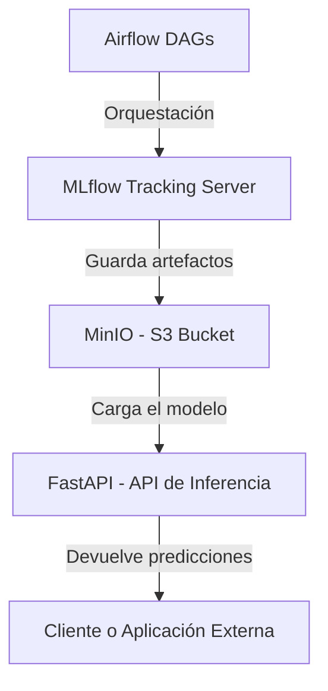

# Proyecto 2

## Integrantes
* Edgar Cruz Martinez
* Juan Camilo Gomez Cano
* Germán Andrés Ospina Quintero


# 🧠 Proyecto MLOps — Airflow + MLflow + MinIO + FastAPI

**Pontificia Universidad Javeriana — MLOps PUJ**  
**Profesor:** Cristian Díaz Álvarez  
**Curso:** Machine Learning Operations (MLOps)**  
**Fecha:** Octubre 2025  

---

## 🚀 Descripción General

Este proyecto implementa una arquitectura **MLOps completa** usando **Docker Compose**, integrando los principales componentes del ciclo de vida de Machine Learning:

- **Airflow:** Orquestación y automatización de pipelines.  
- **MLflow:** Registro, versionamiento y gestión de modelos.  
- **MinIO:** Almacenamiento de artefactos tipo S3.  
- **FastAPI:** Despliegue del modelo como servicio de inferencia.

Todo se ejecuta en una máquina con IP **10.43.100.84**, permitiendo la **ejecución reproducible y modular** de un flujo de trabajo ML, desde el entrenamiento hasta la inferencia.

---

## 🧩 Arquitectura General



---

## 🌐 Componentes y Accesos

| Servicio | Rol | Puerto | URL |
|-----------|-----|--------|-----|
| **Airflow UI** | Orquestación de pipelines ML | 8080 | [http://10.43.100.84:8080](http://10.43.100.84:8080) |
| **MLflow UI** | Registro de experimentos y métricas | 5001 | [http://10.43.100.84:5001](http://10.43.100.84:5001) |
| **MinIO Console** | Repositorio de artefactos S3 | 9001 | [http://10.43.100.84:9001](http://10.43.100.84:9001) |
| **FastAPI Docs** | API de inferencia del modelo | 8000 | [http://10.43.100.84:8000/docs](http://10.43.100.84:8000/docs) |

---

## ⚙️ Requisitos Previos

```bash
Docker Engine ≥ 25.0
Docker Compose ≥ 2.27
Python ≥ 3.10
Sistema operativo Linux o VM (entorno PUJ)
Puertos libres: 8080, 5001, 9000, 9001, 8000
```

---

## 📁 Estructura del Proyecto

```bash
Proyecto_2/
│
├── airflow/
│   ├── dags/                # Definición de DAGs (pipelines)
│   ├── logs/                # Logs de ejecución
│   ├── config/              # Configuración personalizada
│   └── plugins/             # Operadores y hooks personalizados
│
├── mlflow/                  # Configuración y Dockerfile de MLflow
├── api/                     # Código de la API FastAPI
├── docker-compose.yml       # Orquestación de todos los servicios
└── .env                     # Variables de entorno (UID, claves, credenciales)
```

---

## 🔐 Archivo `.env` (Ejemplo)

```bash
TZ=America/Bogota
AIRFLOW_UID=50000
AIRFLOW_GID=0
_AIRFLOW_WWW_USER_USERNAME=airflow
_AIRFLOW_WWW_USER_PASSWORD=airflow
AIRFLOW_FERNET_KEY=YVZy5w0j2xwq7nA0kQ0Yt8p0B0p9F0iQf3rG9y3C0gI=
```


---

## 🐳 Despliegue de la Arquitectura

### 1️⃣ Inicializar Airflow

```bash
docker compose up -d airflow-init
docker compose logs -f airflow-init
```

### 2️⃣ Levantar todos los servicios

```bash
docker compose up -d
```

### 3️⃣ Verificar estado de los contenedores

```bash
docker ps --format "table {{.Names}}\t{{.Status}}\t{{.Ports}}"
```

**Ejemplo de salida esperada:**

```
airflow_webserver      Up (healthy)   0.0.0.0:8080->8080/tcp
mlflow_server          Up (healthy)   0.0.0.0:5001->5000/tcp
minio_server           Up (healthy)   0.0.0.0:9001->9001/tcp
fastapi_application    Up (healthy)   0.0.0.0:8000->8000/tcp
```

---

## 🔗 Acceso a los Servicios

| Servicio | URL | Usuario | Contraseña |
|-----------|------|----------|-------------|
| Airflow UI | [http://10.43.100.84:8080](http://10.43.100.84:8080) | airflow | airflow |
| MLflow UI | [http://10.43.100.84:5001](http://10.43.100.84:5001) | - | - |
| MinIO Console | [http://10.43.100.84:9001](http://10.43.100.84:9001) | admin | supersecret |
| FastAPI Docs | [http://10.43.100.84:8000/docs](http://10.43.100.84:8000/docs) | - | - |

---

## 🧠 Flujo de Trabajo (End-to-End)

1. **Airflow DAG** ejecuta un pipeline con tareas de:
   - Ingesta de datos  
   - Preprocesamiento  
   - Entrenamiento del modelo  
   - Registro del experimento en MLflow  

2. **MLflow** registra:
   - Parámetros del entrenamiento  
   - Métricas (Accuracy, F1, Recall, etc.)  
   - Artefactos del modelo (ej. `.pkl`, `conda.yaml`)  

3. **MinIO** almacena los artefactos como backend tipo S3.  

4. **FastAPI** carga el modelo desde MLflow y expone un endpoint `/predict` para inferencia en tiempo real.

---

## 🧪 Ejemplo de Prueba con FastAPI

### Solicitud

```bash
curl -X POST "http://10.43.100.84:8000/predict" \
     -H "Content-Type: application/json" \
     -d '{
           "aspect": 42,
           "elevation": 3123,
           "hillshade_3pm": 123,
           "hillshade_9am": 222,
           "hillshade_noon": 212,
           "horizontal_distance_to_fire_points": 2912,
           "horizontal_distance_to_hydrology": 323,
           "horizontal_distance_to_roadways": 5042,
           "slope": 13,
           "soil_type": "C7746",
           "vertical_distance_to_hydrology": 59,
           "wilderness_area": "Rawah"
        }'
```

### Respuesta esperada

```json
{
  "covertype": 0,
  "probability": 0.97
}
```

---

## 🔁 Integraciones entre Componentes

| Componente | Variable / Conexión | Descripción |
|-------------|---------------------|--------------|
| Airflow → MLflow | `AIRFLOW_CONN_MLFLOW` | Registra métricas y artefactos del pipeline |
| Airflow → FastAPI | `AIRFLOW_CONN_API_URI` | Consume endpoints de inferencia |
| MLflow → MinIO | `MLFLOW_S3_ENDPOINT_URL` | Guarda artefactos S3 |
| FastAPI → MLflow | `MLFLOW_TRACKING_URI` | Carga el modelo registrado |

---

## 🧰 Comandos Útiles

| Acción | Comando |
|--------|----------|
| Ver contenedores activos | `docker ps` |
| Ver logs de Airflow | `docker compose logs -f airflow_webserver` |
| Reiniciar servicios | `docker compose restart` |
| Apagar todo | `docker compose down -v` |
| Reconstruir desde cero | `docker compose build --no-cache && docker compose up -d` |

---

## ✅ Resultados Esperados

- DAGs ejecutándose correctamente en Airflow  
- Experimentos registrados en MLflow  
- Artefactos almacenados en MinIO  
- API funcional con predicciones en FastAPI  
- Todo orquestado en contenedores reproducibles con Docker  

---


---

## 🧭 Resumen Final

**Qué lograste:**  
Integrar orquestación (Airflow), registro (MLflow), artefactos (MinIO) y despliegue (FastAPI).  

**Para qué sirve:**  
Reproducir y automatizar el ciclo de vida completo de un modelo ML.  

**Cómo aplicarlo:**  
Con `docker compose up -d` levantas todo el entorno en minutos, ideal para entornos de práctica, prototipado o CI/CD en MLOps.

[](https://www.youtube.com/watch?v=-s2GT-5wVvA)
