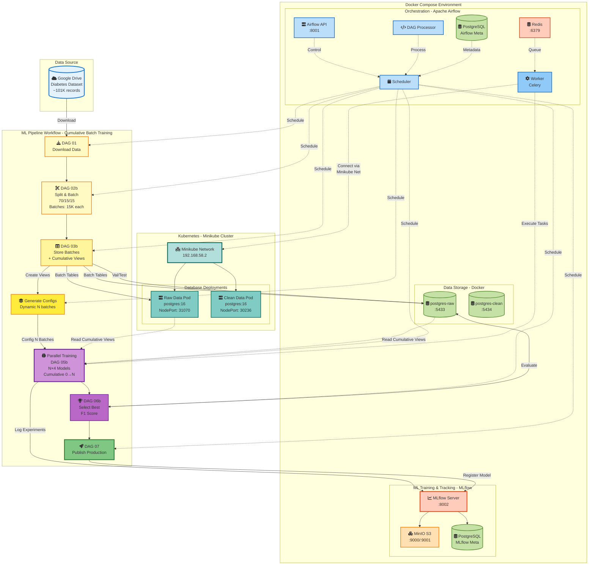

# MLOps Diabetes Readmission Prediction

A production-ready MLOps platform for predicting diabetes patient hospital readmission using Apache Airflow, MLflow, Docker, and Kubernetes. This project demonstrates end-to-end machine learning workflow automation including data ingestion, preprocessing, model training, experiment tracking, and deployment.

## Table of Contents

- [Project Description](#project-description)
- [Requirements](#requirements)
- [Architecture](#architecture)
- [Step-by-Step Workflow](#step-by-step-workflow)
- [How to Run the Project](#how-to-run-the-project)
- [Retrieving Trained Models](#retrieving-trained-models)
- [Video Explanation](#video-explanation)
- [Contributing](#contributing)

---

## Project Description

This MLOps platform automates the complete lifecycle of a diabetes patient readmission prediction model using an innovative **Cumulative Batch Training** approach. The system handles:

- **Automated Data Pipeline**: Download, split into batches, and store diabetes hospital readmission dataset (~101,767 records with 50+ features)
- **Dynamic Batch Processing**: Automatically divides training data into batches of 15,000 records and creates cumulative views
- **Cumulative Model Training**: Trains 4 classification algorithms (Logistic Regression, Decision Tree, Random Forest, Gradient Boosting) on **7 progressively larger datasets** (15K → 102K records) to identify optimal training data size
- **Parallel Execution**: Trains **28 models in parallel** (7 cumulative datasets × 4 algorithms) using Airflow Celery workers
- **Experiment Tracking**: Uses MLflow to track all experiments, parameters, metrics, and model artifacts with full lineage
- **Intelligent Model Selection**: Automatically selects the best performing model across all 28 trained models based on validation F1 score
- **Model Registry**: Publishes production-ready models to MLflow Model Registry with version control
- **Hybrid Infrastructure**: Combines Docker Compose (orchestration & ML services) with Kubernetes (database services) via Minikube network bridge
- **Performance Analysis**: Provides insights into optimal training data size and performance scaling patterns

**Key Innovation**: The cumulative batch training strategy answers the critical question: "How much data do we need for optimal performance?" by systematically training models on increasing data volumes (15K, 30K, 45K, 60K, 75K, 90K, 102K records) and comparing results.

**Key Technologies**: Apache Airflow 3.1.0, MLflow 3.4.0, PostgreSQL 16, Redis 7.2, MinIO S3, Docker, Kubernetes (Minikube), scikit-learn 1.4.2, Python 3.10

---

## Requirements

### System Requirements

- **Operating System**: Linux/macOS/Windows with WSL2
- **RAM**: Minimum 8GB (16GB recommended)
- **CPU**: Minimum 4 cores
- **Disk Space**: 20GB free space
- **Docker**: Version 20.10 or higher
- **Docker Compose**: Version 2.0 or higher
- **Minikube**: Version 1.30 or higher (for Kubernetes deployment)
- **kubectl**: Version 1.25 or higher

### Software Dependencies

#### Python Dependencies (Airflow)
```
mlflow==3.4.0
pycaret==3.3.2
pandas==2.1.4
joblib==1.3.2
scikit-learn==1.4.2
numpy==1.26.4
pyarrow==15.0.0
scipy==1.11.4
```

See [airflow/requirements.txt](airflow/requirements.txt) and [mlflow/requirements.txt](mlflow/requirements.txt) for complete dependency lists.

#### Docker Images Used

- `apache/airflow:3.1.0` (custom build with ML dependencies)
- `postgres:16`
- `redis:7.2-bookworm`
- `python:3.10-slim` (MLflow server)
- `quay.io/minio/minio:latest`
- `minio/mc` (MinIO client)

---

## Architecture

### Unified MLOps Platform Architecture

This diagram shows the complete architecture integrating Docker Compose services, Kubernetes databases, and the ML pipeline workflow.



### Cumulative Batch Pipeline Flow

This pipeline dynamically trains models on increasing data volumes to find the optimal training dataset size.

```mermaid
flowchart TD
    Start([Start Pipeline]) --> Download["fa:fa-download DAG 01<br/>Download Diabetes Dataset<br/>~101,767 records"]

    Download --> Batch["fa:fa-cut DAG 02b<br/>Create Batches<br/>Split: Train 70% / Val 15% / Test 15%<br/>Batch Size: 15,000 records"]

    Batch --> Store["fa:fa-table DAG 03b<br/>Store in PostgreSQL<br/>• 7 batch tables (batch_0 to batch_6)<br/>• Cumulative views (0→N)<br/>• Validation & Test tables"]

    Store --> Generate["fa:fa-layer-group Generate Configs<br/>Dynamic Configuration<br/>Based on actual batch count"]

    Generate --> Parallel["fa:fa-brain DAG 05b<br/>Parallel Cumulative Training<br/><br/>╔════════════════════════╗<br/>║ Cumulative 0: 15K      ║ → 4 models<br/>║ Cumulative 1: 30K      ║ → 4 models<br/>║ Cumulative 2: 45K      ║ → 4 models<br/>║ Cumulative 3: 60K      ║ → 4 models<br/>║ Cumulative 4: 75K      ║ → 4 models<br/>║ Cumulative 5: 90K      ║ → 4 models<br/>║ Cumulative 6: 102K     ║ → 4 models<br/>╚════════════════════════╝<br/><br/>Total: 7×4 = 28 models"]

    Parallel --> Models["fa:fa-flask Model Types per Batch<br/>1. Logistic Regression<br/>2. Decision Tree<br/>3. Random Forest<br/>4. Gradient Boosting"]

    Models --> Aggregate["fa:fa-table DAG 06b<br/>Aggregate Results<br/>Compare all 28 models"]

    Aggregate --> Select["fa:fa-trophy Select Best Model<br/>Rank by F1 Score<br/>Evaluate on full validation set"]

    Select --> Publish["fa:fa-rocket DAG 07<br/>Publish to Production<br/>MLflow Model Registry<br/>Stage: Production"]

    Publish --> End([End Pipeline])

    Parallel -.->|Log to| MLflow["fa:fa-chart-line MLflow<br/>Track experiments<br/>Store artifacts"]

    style Start fill:#4caf50,color:#fff,stroke:#2e7d32,stroke-width:3px
    style Download fill:#2196f3,color:#fff,stroke:#1565c0,stroke-width:2px
    style Batch fill:#2196f3,color:#fff,stroke:#1565c0,stroke-width:2px
    style Store fill:#ff9800,color:#fff,stroke:#e65100,stroke-width:2px
    style Generate fill:#ffc107,color:#000,stroke:#f57f17,stroke-width:2px
    style Parallel fill:#9c27b0,color:#fff,stroke:#6a1b9a,stroke-width:3px
    style Models fill:#673ab7,color:#fff,stroke:#4527a0,stroke-width:2px
    style Aggregate fill:#3f51b5,color:#fff,stroke:#283593,stroke-width:2px
    style Select fill:#00bcd4,color:#fff,stroke:#006064,stroke-width:2px
    style Publish fill:#4caf50,color:#fff,stroke:#2e7d32,stroke-width:3px
    style End fill:#4caf50,color:#fff,stroke:#2e7d32,stroke-width:3px
    style MLflow fill:#e91e63,color:#fff,stroke:#880e4f,stroke-width:2px
```



### Key Architecture Features

**Dynamic Cumulative Training**
- Automatically determines batch count based on dataset size
- Creates N cumulative datasets: each containing progressively more data
- Trains 4 models on each cumulative dataset (N × 4 total models)
- Identifies optimal training data size for best performance

**Hybrid Docker + Kubernetes**
- Docker Compose: Airflow orchestration, MLflow tracking, Redis queue
- Kubernetes (Minikube): PostgreSQL databases with LoadBalancer access
- Minikube network bridge enables seamless communication

**Scalable Storage**
- PostgreSQL: Raw batches, cumulative views, validation/test data
- MinIO S3: Model artifacts, experiment files
- Multi-database architecture for separation of concerns

---

## Step-by-Step Workflow

This project uses a **Cumulative Batch Training Pipeline** to find the optimal training data size by training models on progressively larger datasets.

### Phase 1: Data Acquisition and Preparation

#### 1. Download Dataset

**DAG**: `dag_01_download_data.py`

- Downloads diabetes hospital readmission dataset from Google Drive
- Dataset: ~101,767 patient records with 50+ features
- Stores CSV file in `/opt/airflow/data/diabetic_data.csv`
- Features include: demographics, diagnoses, medications, procedures, lab results

#### 2. Split and Batch Data

**DAG**: `dag_02b_create_batches.py` (part of `dag_00b_master_cumulative_pipeline.py`)

**Split Strategy**:
- **Training**: 70% (~71,237 records)
- **Validation**: 15% (~15,265 records)
- **Test**: 15% (~15,265 records)
- Uses stratified split to maintain class distribution

**Batching Strategy**:
- Training data divided into batches of **15,000 records each**
- Data is shuffled before batching for random distribution
- Expected result: **7 batches** (6 full batches + 1 partial batch)
  - batch_0: 15,000 records
  - batch_1: 15,000 records
  - batch_2: 15,000 records
  - batch_3: 15,000 records
  - batch_4: 15,000 records
  - batch_5: 15,000 records
  - batch_6: ~11,237 records (remaining)

### Phase 2: Data Storage in PostgreSQL

#### 3. Store Batched Raw Data

**DAG**: `dag_03b_store_batched_raw_data.py`

**Actions**:
1. **Create Batch Tables**: Store each batch in separate PostgreSQL tables
   - `batch_0`, `batch_1`, ..., `batch_6` in `raw_data_db`

2. **Create Cumulative Views**: Dynamic SQL views combining progressive batches
   - `train_cumulative_0`: 15,000 records (batch_0)
   - `train_cumulative_1`: 30,000 records (batch_0 + batch_1)
   - `train_cumulative_2`: 45,000 records (batch_0 + batch_1 + batch_2)
   - `train_cumulative_3`: 60,000 records (batches 0-3)
   - `train_cumulative_4`: 75,000 records (batches 0-4)
   - `train_cumulative_5`: 90,000 records (batches 0-5)
   - `train_cumulative_6`: ~101,237 records (all batches)

3. **Store Validation and Test Data**: Store in separate tables
   - `validation_raw` (~15,265 records)
   - `test_raw` (~15,265 records)

**Database Access**:
- **Docker**: `localhost:5433`
- **Kubernetes**: `192.168.58.2:31070`

### Phase 3: Dynamic Training Configuration

#### 4. Generate Training Configurations

**Function**: `generate_training_tasks()` in `dag_00b_master_cumulative_pipeline.py`

**Process**:
1. Pulls cumulative view information from XCom
2. Determines actual number of batches created (N)
3. Generates training configurations for each cumulative dataset
4. Pushes configurations to XCom for parallel training tasks

**Output Example**:
```
Generating Training Configurations
Number of cumulative datasets: 7
  Config 0: 15000 records (train_cumulative_0)
  Config 1: 30000 records (train_cumulative_1)
  Config 2: 45000 records (train_cumulative_2)
  Config 3: 60000 records (train_cumulative_3)
  Config 4: 75000 records (train_cumulative_4)
  Config 5: 90000 records (train_cumulative_5)
  Config 6: 101237 records (train_cumulative_6)
```

### Phase 4: Parallel Cumulative Training

#### 5. Train Models on All Cumulative Datasets

**DAG**: `dag_05b_train_cumulative_batches.py`

**Training Strategy**:
For **each cumulative dataset** (0 through N), train **4 model types**:

1. **Logistic Regression**
   - `max_iter=1000`, `random_state=42`
   - Fast baseline linear classifier

2. **Decision Tree**
   - `max_depth=10`, `random_state=42`
   - Interpretable tree-based model

3. **Random Forest**
   - `n_estimators=100`, `max_depth=10`, `random_state=42`
   - Ensemble bagging method

4. **Gradient Boosting**
   - `n_estimators=100`, `max_depth=5`, `random_state=42`
   - Sequential ensemble boosting

**Total Models Trained**: **7 cumulative datasets × 4 models = 28 models**

**Training Process per Model**:
1. Read data from cumulative view (e.g., `train_cumulative_3`)
2. Handle missing values and clean data
3. Encode categorical features (LabelEncoder)
4. Encode target variable
5. Normalize features (StandardScaler)
6. Train model on cumulative dataset
7. Calculate training metrics
8. Log to MLflow:
   - Parameters: `model_type`, `cumulative_idx`, `n_features`, `n_samples`
   - Metrics: `train_accuracy`, `train_precision`, `train_recall`, `train_f1_score`, `train_roc_auc`
   - Model artifact with preprocessing pipeline

**Parallel Execution**:
- All 7 cumulative training tasks run in **parallel**
- Each task trains 4 models sequentially
- Uses Airflow Celery workers for distributed execution

**MLflow Integration**:
- Experiment: `diabetes_readmission_prediction`
- Tracking Server: `http://localhost:8002`
- Backend Store: PostgreSQL (metadata)
- Artifact Store: MinIO S3 (model files, scalers, encoders)

### Phase 5: Model Selection and Evaluation

#### 6. Aggregate and Select Best Model

**DAG**: `dag_06b_select_best_cumulative_model.py`

**Process**:

**6a. Aggregate Results** (`aggregate_cumulative_results`)
- Collects results from all 28 trained models
- Creates comparison DataFrame with:
  - Model type
  - Cumulative index (data size)
  - Training metrics
  - MLflow run ID
- Sorts by F1 score (descending)
- Analyzes performance patterns across data volumes

**6b. Select Best Model** (`select_best_model`)
- **Primary Criterion**: Highest validation F1 score
- **Secondary Criterion**: ROC-AUC as tiebreaker
- Loads model from MLflow using best run ID
- Evaluates on validation dataset from PostgreSQL
- Logs validation metrics back to MLflow:
  - `val_accuracy`, `val_precision`, `val_recall`, `val_f1_score`, `val_roc_auc`

**6c. Evaluate on Full Validation Set** (`evaluate_on_full_validation`)
- Loads best model from MLflow
- Evaluates on complete `validation_raw` table
- Calculates final performance metrics
- Logs comprehensive evaluation results

**Insights Gained**:
- Optimal training data size (e.g., does 60K perform better than 102K?)
- Best model type for this dataset
- Performance scaling curve with increasing data
- Efficiency vs. accuracy trade-offs

### Phase 6: Production Deployment

#### 7. Publish to Production

**DAG**: `dag_07_publish_to_production.py`

**Deployment Process**:
1. Retrieve best model's MLflow run ID from XCom
2. Register model in **MLflow Model Registry**
   - Model name: `diabetes_readmission_model`
   - Includes metadata and tags
3. **Transition to Production stage**
   - Archives any existing production versions
   - Sets new version as active production model
4. Update model description with:
   - Model type
   - Cumulative dataset size used
   - Validation F1 score
   - Validation accuracy
   - Training timestamp
5. Complete deployment workflow

**Production Model Access**:
```python
import mlflow
mlflow.set_tracking_uri("http://localhost:8002")
model = mlflow.sklearn.load_model("models:/diabetes_readmission_model/Production")
```

### Pipeline Execution Summary

**Total Execution Time**: ~1-2 hours (depending on hardware)

**Key Advantages of Cumulative Batch Training**:
- Identifies if more data actually improves performance
- Finds the sweet spot between data collection cost and model accuracy
- Provides insights into diminishing returns of larger datasets
- Tests model scalability across different data volumes
- Compares 4 algorithms at each data size for robustness

---

## How to Run the Project

### Prerequisites

1. **Install Docker and Docker Compose**:
   ```bash
   # Verify installation
   docker --version
   docker compose version
   ```

2. **Install Minikube (for Kubernetes deployment)**:
   ```bash
   # Install Minikube
   curl -LO https://storage.googleapis.com/minikube/releases/latest/minikube-linux-amd64
   sudo install minikube-linux-amd64 /usr/local/bin/minikube

   # Verify installation
   minikube version
   ```

3. **Install kubectl**:
   ```bash
   # Verify installation
   kubectl version --client
   ```

### Step 1: Start Kubernetes Databases (Minikube)

#### 1.1 Start Minikube
```bash
# Start Minikube cluster
minikube start --driver=docker

# Verify cluster is running
minikube status
```

#### 1.2 Connect Docker to Minikube Network
```bash
# Get Minikube Docker network
docker network ls | grep minikube

# If network doesn't exist, create it
docker network create minikube
```

#### 1.3 Deploy PostgreSQL Databases to Kubernetes
```bash
# Navigate to Kubernetes manifests directory
cd k8s/komposedbfiles

# Apply deployments
kubectl apply -f postgres-raw-data-deployment.yaml
kubectl apply -f postgres-clean-data-deployment.yaml

# Apply services
kubectl apply -f postgres-raw-data-service.yaml
kubectl apply -f postgres-clean-data-service.yaml

# Verify deployments
kubectl get deployments
kubectl get pods
kubectl get services
```

#### 1.4 Get Minikube IP and Service Ports
```bash
# Get Minikube IP (typically 192.168.58.2)
minikube ip

# Get NodePort for raw-data database
kubectl get service postgres-raw-data -o jsonpath='{.spec.ports[0].nodePort}'

# Get NodePort for clean-data database
kubectl get service postgres-clean-data -o jsonpath='{.spec.ports[0].nodePort}'

# Alternative: Use minikube service to get URL
minikube service postgres-raw-data --url
minikube service postgres-clean-data --url
```

**Expected Output**:
- Raw Data DB: `192.168.58.2:31070`
- Clean Data DB: `192.168.58.2:30236`

### Step 2: Start Docker Compose Services

#### 2.1 Set Environment Variables (Optional)
```bash
# Create .env file with custom settings
echo "AIRFLOW_UID=$(id -u)" > .env
```

#### 2.2 Build Custom Docker Images
```bash
# Build Airflow image with ML dependencies
docker compose -f docker-compose.inference.yml build
```

#### 2.3 Start All Services
```bash
# Start all services in detached mode
docker compose -f docker-compose.inference.yml up -d

# View logs
docker compose -f docker-compose.inference.yml logs -f

# Check service health
docker compose -f docker-compose.inference.yml ps
```

#### 2.4 Wait for Initialization
The `airflow-init` service will:
- Create necessary directories
- Initialize Airflow database
- Create default admin user (`airflow:airflow`)

**Wait for**: "airflow-init exited with code 0"

### Step 3: Access Web Interfaces

#### Airflow UI
- **URL**: http://localhost:8001
- **Username**: `airflow`
- **Password**: `airflow`
- **Purpose**: Monitor DAG runs, trigger pipelines, view logs

#### MLflow UI
- **URL**: http://localhost:8002
- **Purpose**: View experiments, compare models, manage model registry

#### MinIO Console
- **URL**: http://localhost:9001
- **Username**: `admin`
- **Password**: `supersecret`
- **Purpose**: View model artifacts, S3 buckets

### Step 4: Run Cumulative Batch ML Pipeline

#### Run the Master Pipeline (Recommended)

1. **Access Airflow UI**: http://localhost:8001
2. **Login** with credentials:
   - Username: `airflow`
   - Password: `airflow`
3. **Find DAG**: Locate `dag_00b_master_cumulative_pipeline` in the DAG list
4. **Enable DAG**: Toggle the switch to ON (left side of DAG name)
5. **Trigger Pipeline**: Click the play button (▶) on the right to trigger manually
6. **Monitor Progress**:
   - Watch the Graph view to see task dependencies
   - Tasks turn **dark green** when completed successfully
   - Tasks turn **red** if they fail
   - Click on individual tasks to see execution logs
7. **Expected Duration**: ~1-2 hours (trains 28 models in parallel)

#### Pipeline Stages to Monitor

Watch these key stages in the Graph view:

```
Phase 1: Data Acquisition
  ├─ download_diabetes_dataset (2-5 min)
  └─ split_train_val_test (1-2 min)

Phase 2: Batch Storage
  ├─ create_batch_tables (3-5 min)
  ├─ create_cumulative_views (1-2 min)
  └─ store_validation_test (2-3 min)

Phase 3: Dynamic Configuration
  └─ generate_training_configs (1 min)

Phase 4: Parallel Training (15-30 min per cumulative)
  ├─ train_cumulative_0 (4 models on 15K records)
  ├─ train_cumulative_1 (4 models on 30K records)
  ├─ train_cumulative_2 (4 models on 45K records)
  ├─ train_cumulative_3 (4 models on 60K records)
  ├─ train_cumulative_4 (4 models on 75K records)
  ├─ train_cumulative_5 (4 models on 90K records)
  └─ train_cumulative_6 (4 models on ~102K records)

Phase 5: Model Selection
  ├─ aggregate_results (2-3 min)
  ├─ select_best_model (3-5 min)
  └─ evaluate_on_full_validation (2-3 min)

Phase 6: Production Deployment
  └─ publish_best_model_production (2-3 min)
```

#### Alternative: Run Individual DAGs (Advanced)

For debugging or testing individual components, execute DAGs sequentially:

```bash
# Phase 1: Data Acquisition
dag_01_download_data
    ↓
# Phase 2: Batch Creation and Storage
dag_02b_create_batches
    ↓
dag_03b_store_batched_raw_data
    ↓
# Phase 3 & 4: Training (Run after config generation)
dag_05b_train_cumulative_batches
    ↓
# Phase 5: Model Selection
dag_06b_select_best_cumulative_model
    ↓
# Phase 6: Deployment
dag_07_publish_to_production
```

**Note**: When running individual DAGs, ensure each completes successfully before running the next.

### Step 5: View Results

#### MLflow Experiments
1. Open MLflow UI: http://localhost:8002
2. Navigate to "Experiments" → `diabetes_readmission_prediction`
3. Compare runs by metrics (F1 score, accuracy, etc.)
4. View model parameters and artifacts

#### MLflow Model Registry
1. Navigate to "Models" in MLflow UI
2. Find `diabetes_readmission_model`
3. View production version and metadata
4. Download model artifacts

#### Database Verification
```bash
# Connect to raw data database
docker exec -it raw_data psql -U rawdata_user -d raw_data_db

# List tables
\dt

# Query training data
SELECT COUNT(*) FROM train_raw;

# Exit
\q

# Connect to clean data database
docker exec -it clean_data psql -U cleandata_user -d clean_data_db

# Query cleaned data
SELECT COUNT(*) FROM train_clean;
\q
```

### Step 6: Stop Services

#### Stop Docker Compose
```bash
# Stop all services
docker compose -f docker-compose.inference.yml down

# Stop and remove volumes (WARNING: deletes all data)
docker compose -f docker-compose.inference.yml down -v
```

#### Stop Kubernetes Services
```bash
# Delete Kubernetes resources
kubectl delete -f k8s/komposedbfiles/

# Stop Minikube
minikube stop

# Delete Minikube cluster (optional)
minikube delete
```

---

## Retrieving Trained Models

### Python Script to Load Models from MLflow

```python
import mlflow
from mlflow.tracking import MlflowClient
import pandas as pd
from sklearn.preprocessing import LabelEncoder, StandardScaler

# Configure MLflow tracking URI
mlflow.set_tracking_uri("http://localhost:8002")

# Initialize MLflow client
client = MlflowClient()

# ============================================
# Method 1: Load Production Model from Registry
# ============================================

def load_production_model():
    """
    Load the current production model from MLflow Model Registry
    """
    model_name = "diabetes_readmission_model"

    # Get production model
    model_uri = f"models:/{model_name}/Production"
    model = mlflow.sklearn.load_model(model_uri)

    print(f"Loaded production model: {model_name}")
    print(f"Model type: {type(model).__name__}")

    return model

# ============================================
# Method 2: Load Specific Model by Run ID
# ============================================

def load_model_by_run_id(run_id):
    """
    Load a model from a specific MLflow run

    Args:
        run_id (str): MLflow run ID
    """
    model_uri = f"runs:/{run_id}/model"
    model = mlflow.sklearn.load_model(model_uri)

    # Get run information
    run = client.get_run(run_id)
    metrics = run.data.metrics
    params = run.data.params

    print(f"Loaded model from run: {run_id}")
    print(f"Model type: {params.get('model_type', 'Unknown')}")
    print(f"Training F1 Score: {metrics.get('train_f1_score', 'N/A')}")
    print(f"Validation F1 Score: {metrics.get('val_f1_score', 'N/A')}")

    return model, metrics, params

# ============================================
# Method 3: Get Best Model from Experiment
# ============================================

def get_best_model_from_experiment(experiment_name="diabetes_readmission_prediction"):
    """
    Find and load the best performing model from an experiment

    Args:
        experiment_name (str): Name of the MLflow experiment
    """
    # Get experiment
    experiment = client.get_experiment_by_name(experiment_name)
    if experiment is None:
        print(f"Experiment '{experiment_name}' not found!")
        return None

    # Search for runs sorted by validation F1 score
    runs = client.search_runs(
        experiment_ids=[experiment.experiment_id],
        order_by=["metrics.val_f1_score DESC"],
        max_results=1
    )

    if not runs:
        print("No runs found in experiment!")
        return None

    best_run = runs[0]
    run_id = best_run.info.run_id

    print(f"Best model found:")
    print(f"  Run ID: {run_id}")
    print(f"  Model: {best_run.data.params.get('model_type')}")
    print(f"  Val F1 Score: {best_run.data.metrics.get('val_f1_score')}")
    print(f"  Val Accuracy: {best_run.data.metrics.get('val_accuracy')}")

    # Load the model
    model_uri = f"runs:/{run_id}/model"
    model = mlflow.sklearn.load_model(model_uri)

    return model, best_run

# ============================================
# Method 4: List All Available Models
# ============================================

def list_all_trained_models(experiment_name="diabetes_readmission_prediction"):
    """
    List all models in an experiment with their metrics
    """
    # Get experiment
    experiment = client.get_experiment_by_name(experiment_name)
    if experiment is None:
        print(f"Experiment '{experiment_name}' not found!")
        return

    # Get all runs
    runs = client.search_runs(
        experiment_ids=[experiment.experiment_id],
        order_by=["metrics.val_f1_score DESC"]
    )

    print(f"\nFound {len(runs)} models in experiment '{experiment_name}':\n")

    results = []
    for run in runs:
        model_info = {
            'run_id': run.info.run_id,
            'model_type': run.data.params.get('model_type', 'Unknown'),
            'train_f1': run.data.metrics.get('train_f1_score', 0),
            'val_f1': run.data.metrics.get('val_f1_score', 0),
            'val_accuracy': run.data.metrics.get('val_accuracy', 0),
            'n_features': run.data.params.get('n_features', 'N/A'),
            'n_samples': run.data.params.get('n_samples', 'N/A')
        }
        results.append(model_info)

    # Create DataFrame for better visualization
    df = pd.DataFrame(results)
    print(df.to_string(index=False))

    return df

# ============================================
# Method 5: Make Predictions with Loaded Model
# ============================================

def predict_with_model(model, data):
    """
    Make predictions using a loaded model

    Args:
        model: Loaded scikit-learn model
        data: pandas DataFrame with features

    Returns:
        predictions: numpy array of predictions
        probabilities: numpy array of prediction probabilities
    """
    # Make predictions
    predictions = model.predict(data)

    # Get prediction probabilities (if available)
    if hasattr(model, 'predict_proba'):
        probabilities = model.predict_proba(data)
    else:
        probabilities = None

    return predictions, probabilities

# ============================================
# Example Usage
# ============================================

if __name__ == "__main__":
    print("=" * 60)
    print("MLflow Model Recovery Examples")
    print("=" * 60)

    # Example 1: Load production model
    print("\n1. Loading Production Model:")
    print("-" * 60)
    try:
        prod_model = load_production_model()
    except Exception as e:
        print(f"Error loading production model: {e}")

    # Example 2: List all models
    print("\n2. Listing All Trained Models:")
    print("-" * 60)
    models_df = list_all_trained_models()

    # Example 3: Get best model
    print("\n3. Loading Best Model from Experiment:")
    print("-" * 60)
    best_model, best_run = get_best_model_from_experiment()

    # Example 4: Load specific model by run ID
    print("\n4. Loading Specific Model by Run ID:")
    print("-" * 60)
    if models_df is not None and len(models_df) > 0:
        sample_run_id = models_df.iloc[0]['run_id']
        model, metrics, params = load_model_by_run_id(sample_run_id)

    # Example 5: Get registered model versions
    print("\n5. Model Registry Versions:")
    print("-" * 60)
    try:
        model_name = "diabetes_readmission_model"
        versions = client.search_model_versions(f"name='{model_name}'")

        for version in versions:
            print(f"\nVersion: {version.version}")
            print(f"  Stage: {version.current_stage}")
            print(f"  Run ID: {version.run_id}")
            print(f"  Status: {version.status}")
    except Exception as e:
        print(f"Error fetching model versions: {e}")

    print("\n" + "=" * 60)
    print("Recovery Complete!")
    print("=" * 60)
```

### Save the Script

Save the above script as `retrieve_models.py` and run:

```bash
# Ensure MLflow server is running
python retrieve_models.py
```

### Expected Output

```
============================================================
MLflow Model Recovery Examples
============================================================

1. Loading Production Model:
------------------------------------------------------------
Loaded production model: diabetes_readmission_model
Model type: GradientBoostingClassifier

2. Listing All Trained Models:
------------------------------------------------------------
Found 4 models in experiment 'diabetes_readmission_prediction':

                     run_id          model_type  train_f1  val_f1  val_accuracy  n_features  n_samples
abc123...  GradientBoostingClassifier    0.6234  0.6189        0.6234          45      71237
def456...        RandomForestClassifier    0.6198  0.6156        0.6198          45      71237
ghi789...          DecisionTreeClassifier    0.5987  0.5923        0.5987          45      71237
jkl012...    LogisticRegressionClassifier    0.5856  0.5801        0.5856          45      71237

3. Loading Best Model from Experiment:
------------------------------------------------------------
Best model found:
  Run ID: abc123...
  Model: GradientBoostingClassifier
  Val F1 Score: 0.6189
  Val Accuracy: 0.6234
```

---

## Video Explanation

> **TODO**: Add link to video explanation here

### Suggested Video Structure

1. **Introduction** (0:00-1:00)
   - Project overview and objectives
   - MLOps platform components

2. **Architecture Walkthrough** (1:00-3:00)
   - Docker Compose services
   - Kubernetes deployment
   - Network connectivity

3. **Starting the Platform** (3:00-6:00)
   - Minikube setup
   - Docker Compose startup
   - Accessing web interfaces

4. **Running the Pipeline** (6:00-10:00)
   - Triggering Airflow DAGs
   - Monitoring execution
   - Viewing logs

5. **Model Training & Tracking** (10:00-13:00)
   - MLflow experiments
   - Model comparison
   - Model registry

6. **Results & Deployment** (13:00-15:00)
   - Best model selection
   - Production deployment
   - Model retrieval

7. **Conclusion** (15:00-16:00)
   - Key takeaways
   - Future improvements

---

## Contributing

We welcome contributions to improve this MLOps platform! Here's how you can contribute:

### Reporting Issues

1. **Check Existing Issues**: Search [GitHub Issues](../../issues) to avoid duplicates
2. **Create New Issue**: Provide detailed information:
   - Environment (OS, Docker version, Minikube version)
   - Steps to reproduce
   - Expected vs actual behavior
   - Error messages and logs

### Suggesting Enhancements

1. Open an issue with the label `enhancement`
2. Describe the proposed feature and its benefits
3. Provide use cases and examples

### Pull Request Process

1. **Fork the Repository**
   ```bash
   git clone https://github.com/yourusername/MLOps-Grupo2.git
   cd MLOps-Grupo2/Proyectos/Proyecto_grupo_2_Parte_2
   ```

2. **Create a Feature Branch**
   ```bash
   git checkout -b feature/your-feature-name
   ```

3. **Make Changes**
   - Follow existing code style
   - Add comments for complex logic
   - Update documentation if needed

4. **Test Your Changes**
   ```bash
   # Test locally with Docker Compose
   docker compose -f docker-compose.inference.yml up --build

   # Run pipeline to verify functionality
   ```

5. **Commit Changes**
   ```bash
   git add .
   git commit -m "Add feature: your feature description"
   ```

6. **Push to GitHub**
   ```bash
   git push origin feature/your-feature-name
   ```

7. **Create Pull Request**
   - Go to GitHub repository
   - Click "New Pull Request"
   - Describe changes and link related issues
   - Request review from maintainers

### Development Guidelines

#### Code Style
- **Python**: Follow PEP 8 style guide
- **DAGs**: Use descriptive task IDs and clear documentation
- **Docker**: Optimize layer caching and minimize image size

#### Testing
- Test all DAGs individually before integration
- Verify database connections and queries
- Ensure MLflow logging works correctly
- Test with different data volumes

#### Documentation
- Update README for new features
- Add docstrings to Python functions
- Comment complex SQL queries
- Update architecture diagrams if structure changes

### Areas for Contribution

We especially welcome contributions in these areas:

1. **API Development**
   - Build REST API for model inference
   - Add endpoints for model management
   - Implement authentication

2. **Frontend Development**
   - Create web UI for pipeline monitoring
   - Build model comparison dashboard
   - Add data visualization features

3. **Testing & Quality**
   - Add unit tests for data processing
   - Create integration tests for pipelines
   - Implement load testing with Locust

4. **Observability**
   - Add Prometheus metrics
   - Integrate with Grafana
   - Implement distributed tracing

5. **Model Improvements**
   - Add hyperparameter tuning (GridSearch, Optuna)
   - Implement cross-validation
   - Add more algorithms (XGBoost, LightGBM, Neural Networks)

6. **Documentation**
   - Add more detailed setup guides
   - Create troubleshooting section
   - Add architecture decision records (ADRs)

### Code of Conduct

- Be respectful and inclusive
- Provide constructive feedback
- Focus on collaboration and learning
- Help others in discussions

### Contact

For questions or discussions, please:
- Open an issue on GitHub
- Contact project maintainers
- Join project discussions

---

## License

This project is licensed under the Apache License 2.0 - see the LICENSE file for details.

---

## Acknowledgments

- **Apache Airflow** - Workflow orchestration platform
- **MLflow** - ML lifecycle management
- **scikit-learn** - Machine learning algorithms
- **MinIO** - S3-compatible object storage
- **PostgreSQL** - Relational database
- **Docker** & **Kubernetes** - Containerization and orchestration

---

## Project Status

**Current Version**: 1.0.0

**Status**: Active Development

**Last Updated**: 2025

---