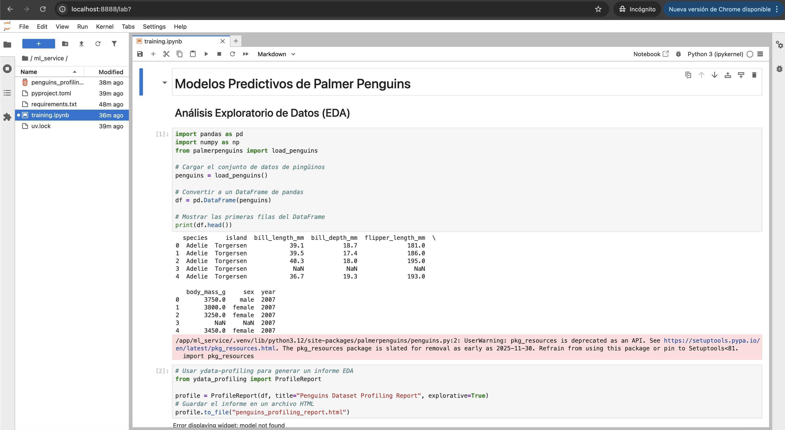

# Taller 2: Nivel 1 - Desarrollo en Contenedores

## Integrantes
* Edgar Cruz Martinez
* Juan Camilo Gomez Cano
* Germán Andrés Ospina Quintero

## Documentación del funcionamiento

En el siguiente video se presenta el funcionamiento del proyecto:

[](https://www.youtube.com/watch?v=iqvIPvcs0GY)

---

Este proyecto implementa una arquitectura básica de MLOps que permite al equipo de desarrollo:

- Crear y entrenar modelos de machine learning en un entorno interactivo de Jupyter Notebook, desplegado mediante Docker y gestionado con el gestor de paquetes `uv`.
- Almacenar los modelos generados en una carpeta compartida (`models`) para su posterior consumo.
- Exponer una API desarrollada con FastAPI que permite seleccionar y utilizar los modelos entrenados para realizar inferencias.

## Estructura del Proyecto

- `jupyter/`: Contiene el Dockerfile y dependencias para levantar el servidor de Jupyter Lab.
- `models/`: Carpeta donde se almacenan los modelos generados por los notebooks y que serán consumidos por el API.
- `api/`: Código y Dockerfile para el servicio de inferencia con FastAPI.
- `docker-compose.yml`: Orquestador de los servicios (Jupyter y API).
- `README.md`: Este archivo.

## Requisitos

- Docker y Docker Compose instalados en el sistema.

## ¿Cómo ejecutar y usar la aplicación?


### 1. Clona el repositorio y navega a la carpeta del proyecto

```bash
git clone https://github.com/jcamilogomezc/MLOps-Grupo2.git
cd MLOps-Grupo2/Talleres/Taller_2
```

### 2. Construye y levanta los servicios con Docker Compose

```bash
docker-compose -f docker-compose.yml up --build
```

### 3. Accede a Jupyter Lab

Abre tu navegador y entra a [http://localhost:8888](http://localhost:8888). Utiliza el token definido en la variable de entorno `JUPYTER_TOKEN` en el `docker-compose.yml` (o el que aparece en la consola al iniciar el contenedor).


### 4. Abre el notebook de entrenamiento

En el explorador de archivos de Jupyter, navega a la carpeta correspondiente (por ejemplo, `/ml_service` o `/app/ml_service` según la configuración del contenedor) y abre el archivo `training.ipynb`. Este notebook contiene el flujo para analizar, limpiar y crear modelos sobre el dataset de [Palmer Penguins](https://www.kaggle.com/code/joeportilla/an-lisis-exploratorio-de-datos-palmer-penguins).



### 5. Ejecuta el notebook para entrenar y guardar modelos

Sigue los pasos del notebook para entrenar los modelos. Los archivos generados se guardarán automáticamente en la carpeta `models`, la cual es compartida entre los servicios.


### 6. Verifica los modelos generados

Los modelos entrenados aparecerán en la carpeta `models` y estarán listos para ser utilizados por el API.


### 7. Prueba la API de inferencia

Puedes interactuar con la API usando `curl` o cualquier cliente HTTP. Ejemplos:

**a) Mensaje de bienvenida:**
```bash
curl --location 'http://localhost:8989'
```

**b) Estado del API y modelos disponibles:**
```bash
curl --location 'http://localhost:8989/status'
```

**c) Realizar una inferencia con un modelo específico:**
```bash
curl --location 'http://localhost:8989/predict' \
	--header 'Content-Type: application/json' \
	--data '{
		"model": "random_forest",
		"penguins": [
			{
				"bill_length_mm": 39.1,
				"bill_depth_mm": 18.7,
				"island": "Torgersen",
				"flipper_length_mm": 193.0,
				"body_mass_g": 3800.0,
				"sex": "female"
			}
		]
	}'
```

## Contribuciones
Si quieres contribuir en el proyecto genera una nueva rama tomando como base `main`!
