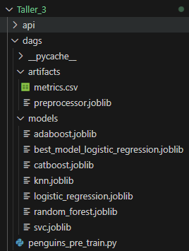
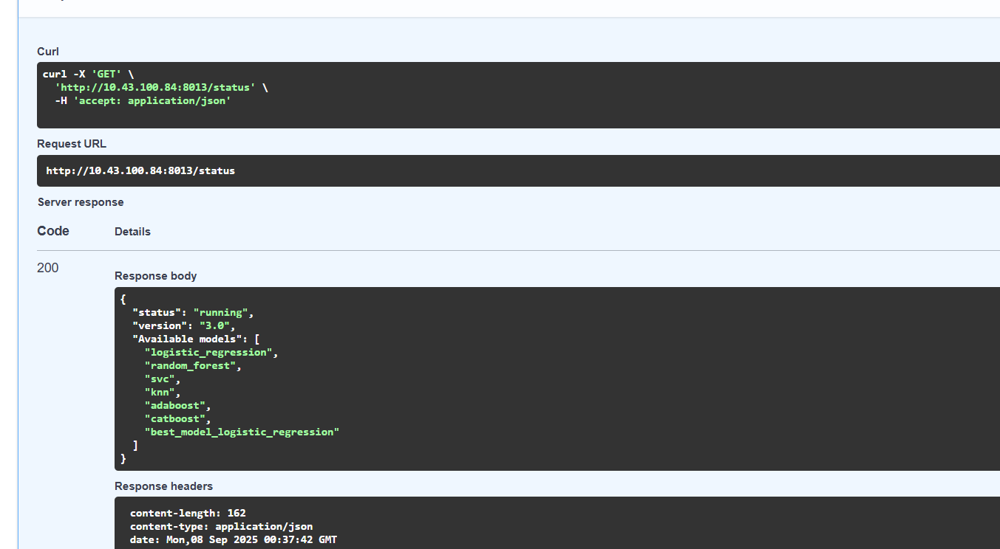
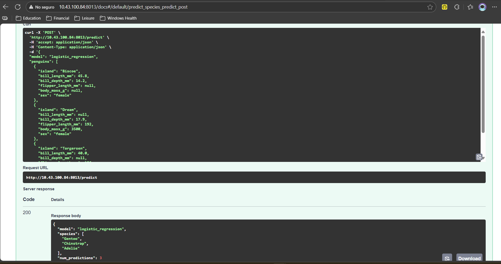
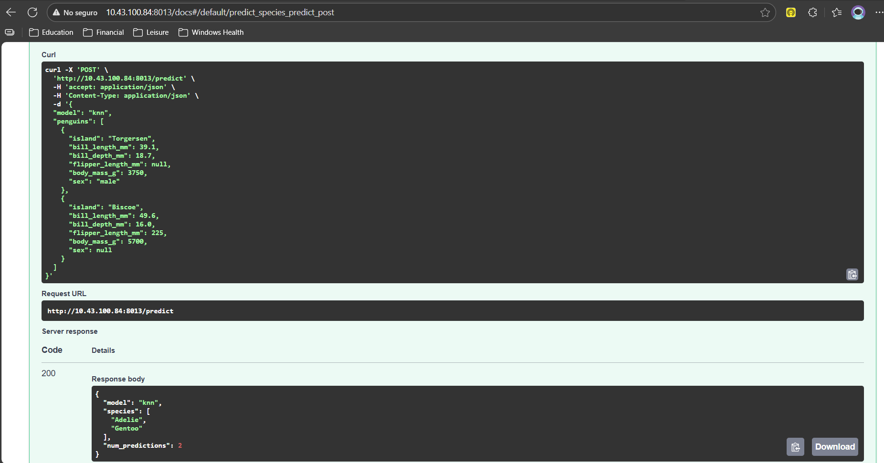
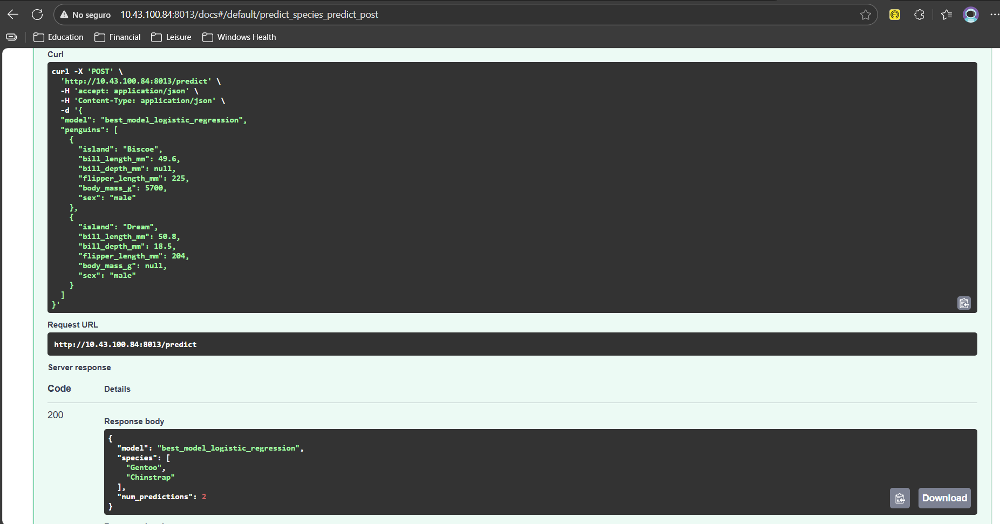

# Taller 3: Nivel 2 - Desarrollo con Airflow

## Integrantes
* Edgar Cruz Martinez
* Juan Camilo Gomez Cano
* Germán Andrés Ospina Quintero

## Documentación del funcionamiento

En el siguiente video se presenta el funcionamiento del proyecto:

[](https://www.youtube.com/watch?v=XRCuq-75cLA)

---

Este proyecto integra un pipeline MLOps usando Python, Docker, Apache Airflow, FastAPI, bases de datos y varias librerías de machine learning para automatizar, entrenar y desplegar modelos que predicen especies de pingüinos según el dataset Palmer Penguins.

***

## Tabla de Contenidos

- Propósito y objetivos
- Tecnologías utilizadas
- Estructura del proyecto
- Instalación, configuración y despliegue
- Pipeline MLOps detallado
- API de predicción
- Artículos, artefactos y modelos generados
- Posibles mejoras
- Autores y licencia

***

## Propósito y Objetivos

Desarrollar un flujo completo de operaciones automatizadas de machine learning (MLOps), usando datos reales, orquestación de tareas, gestión de modelos y exposición a través de APIs, aplicando buenas prácticas de ingeniería y operación para proyectos ML relevantes en la industria.

***

## Tecnologías Utilizadas

- **Python**: núcleo del procesamiento y entrenamiento ML.
- **FastAPI \& Uvicorn**: servidor de API rápido para servir predicciones de modelos.
- **Apache Airflow**: orquestador de pipelines de entrenamiento y preprocesamiento.
- **Docker \& Docker Compose**: virtualización de entornos y fácil despliegue.
- **MySQL**: persistencia y manejo de los datos procesados.
- **Scikit-learn, Pandas, Numpy, CatBoost, Joblib**: librerías para procesamiento y modelado ML.
- **PalmerPenguins**: dataset para el caso de uso.

***

## Estructura del Proyecto

```
Taller_3/
├── .env                      # Variables de entorno para credenciales y configuración
├── .gitignore                # Ignora archivos temporales y artefactos
├── docker-compose.yml        # Orquestación de servicios en Docker
├── Dockerfile                # Ambiente base de la app principal
├── requirements.txt          # Paquetes requeridos Python
├── penguins_examples.txt     # Ejemplo de entrada para la API
├── api/
│   ├── .dockerignore         # Exclusiones de docker build
│   ├── data_models.py        # Estructuras de datos (Pydantic) para API
│   ├── Dockerfile            # Imagen para el microservicio FastAPI
│   ├── main.py               # Lógica y rutas de la API de predicción
│   ├── requirements.txt      # Paquetes fastapi y dependencias
├── dags/
│   ├── penguins_pre_train.py # DAG principal para pipeline ML en Airflow
│   ├── artifacts/
│   │   ├── metrics.csv       # Métricas de modelos entrenados
│   │   ├── preprocessor.joblib # Pipeline de preprocesamiento serializado
│   ├── models/
│   │   ├── adaboost.joblib
│   │   ├── best_model_logistic_regression.joblib
│   │   ├── catboost.joblib
│   │   ├── knn.joblib
│   │   ├── logistic_regression.joblib
│   │   ├── random_forest.joblib
│   │   ├── svc.joblib
```


***

## Instalación, Configuración y Despliegue

**1. Clona el repositorio y ubica el directorio principal:**

```bash
git clone https://github.com/jcamilogomezc/MLOps-Grupo2/tree/main/Talleres/Taller_3
cd Taller_3
```

**2. Variables de entorno:**
Edita `.env` con las credenciales de tu base de datos MySQL y otros secretos (ver ejemplo en el repositorio).

**3. Instalación de dependencias:**
Instala dependencias en un entorno Python:

```bash
pip install -r requirements.txt
```

(Alternativamente, usa UV para manejo avanzado.)

**4. Despliegue con Docker Compose:**
Levanta todos los servicios — Airflow, API FastAPI, MySQL — en modo orquestado:

```bash
docker-compose up --build
```

**5. Acceso a los servicios:**

- Airflow: `http://localhost:8080`
- FastAPI (Swagger): `http://localhost:8000/docs`

***

## Pipeline MLOps Detallado

### Orquestación con Airflow

- El DAG (`penguins_pre_train.py`) descarga el dataset Palmer Penguins, realiza **preprocesamiento** con Pipelines de scikit-learn, entrena varios modelos ML clásicos y avanzados (Logistic Regression, Random Forest, CatBoost, SVC, Adaboost, KNN).


- Los **artefactos** (modelos y preprocesador) se guardan en carpetas dedicadas; las métricas del entrenamiento (`metrics.csv`) permiten comparar desempeño.

    

### Modelos y Preprocesamiento

- Los modelos se serializan con `joblib` para fácil reutilización y despliegue.
- El preprocesador serializado asegura que los datos enviados para predicción tengan la misma transformación que los usados en entrenamiento.

***

## API de Predicción

- La API implementada en FastAPI (`api/main.py`) permite realizar predicciones usando cualquiera de los modelos entrenados y soporta entrada individual o batch.



- Las entradas a la API se estructuran con **Pydantic** (`data_models.py`) asegurando validación robusta.
- Ejemplo de llamadas (ver `penguins_examples.txt`) y la documentación interactiva en Swagger.

    - **Ejemplo 1**
    

    - **Ejemplo 2**
    

    - **Ejemplo 3**
    

***

## Artículos, Artefactos y Modelos Generados

- **models/** contiene los modelos entrenados, listos para ser cargados desde la API.
- **artifacts/** contiene el pipeline de preprocesamiento (usado antes de predecir) y las métricas CSV para reporting.

***
