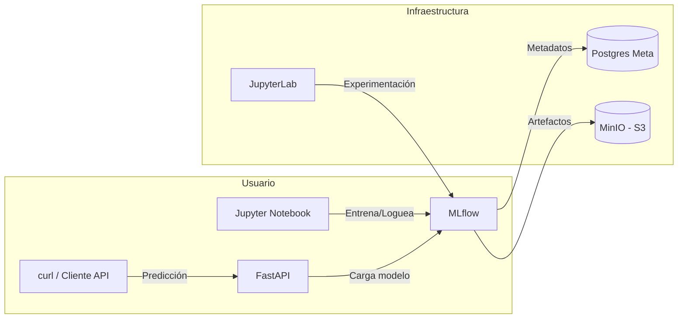

# Taller 4: Nivel 2 - Desarrollo con MLflow y todo un Ecosistema MLOps con MinIO, JupyterLab y FastAPI

## Integrantes
* Edgar Cruz Martinez
* Juan Camilo Gomez Cano
* Germán Andrés Ospina Quintero

## Documentación del funcionamiento
En el siguiente video se presenta el funcionamiento del proyecto:

[](https://www.youtube.com/watch?v=XRCuq-75cLA)

Este repo levanta un entorno local estilo “nube” para todo el ciclo de vida de ML:
**experimentación → tracking/artefactos → registro de modelos → inferencia en API**.

---

## Componentes

| Servicio           | Host:Puerto → Contenedor                   | Rol                                  |
|-------------------|--------------------------------------------|--------------------------------------|
| **MLflow**        | `8080 → 5000`                              | Tracking + Model Registry            |
| **MinIO (S3)**    | `8001 → 9000` (API), `8002 → 9001` (UI)    | Artefactos de modelos                |
| **Postgres meta** | interno: `5432`                            | Metadatos de MLflow                  |
| **Postgres main** | interno: `5432`                            | Datasets                             |
| **JupyterLab**    | `8003 → 8888`                              | Notebooks y experimentos             |
| **FastAPI**       | `8013 → 8013`                              | Inferencia del modelo “en producción”|

> Las URLs de ejemplo asumen ejecución en **localhost**. Si vas por VPN o IP remota, reemplaza `localhost` por la IP correspondiente.

---

## Prerrequisitos
- Docker + Docker Compose
- (Opcional) `make` para usar los atajos del **Makefile**
- (Opcional) `curl` o Postman para probar la API

---

## Quick start

### 1) Clonar y entrar al proyecto
```bash
git clone https://github.com/jcamilogomezc/MLOps-Grupo2.git
cd MLOps-Grupo2/Talleres/Taller_4
```

#### Arrancar todo (con build)
```bash
docker compose up -d --build
```
o con **make**:
```bash
make up
```

Verifica:
```bash
docker ps
docker compose ps
```

### 3) Abrir servicios
- **MLflow UI:** http://localhost:8080  
- **MinIO Console (UI):** http://localhost:8002  
- **JupyterLab:** http://localhost:8003  
  - Token: configurado en `docker-compose.yml` (o corre `jupyter server list` dentro del contenedor)
- **API (FastAPI docs):** http://localhost:8013/docs

> Las credenciales y endpoints S3 para MLflow y la API se inyectan con las variables de entorno `MLFLOW_S3_ENDPOINT_URL`, `AWS_ACCESS_KEY_ID`, `AWS_SECRET_ACCESS_KEY` y `MLFLOW_BUCKET_NAME` en `docker-compose.yml`.

---

## Entrenamiento y registro en MLflow
1. Entra a **JupyterLab** → abre `jupyter/notebooks/Pinguinos.ipynb`.
2. Ejecuta las celdas. El notebook:
   - Lee datos (y puede escribir a BD si lo ajustas).
   - Realiza ≥ 20 corridas variando hiperparámetros.
   - Loguea parámetros, métricas y artefactos en **MLflow**.
3. Abre **MLflow UI** (http://localhost:8080) y revisa el experimento.
4. Registra el mejor modelo como **`PenguinsClassifier`** y promuévelo a **Stage = `Production`**.

> **Importante:** La API solo carga el modelo si hay una versión en `Production` (o si defines una **versión** explícita por variable de entorno).

---

## Probar la API de inferencia

Si ya marcaste un modelo en **Production**, reinicia la API:
```bash
docker compose restart api_inference
```
o
```bash
make restart-api
```

**Healthcheck**
```bash
curl http://localhost:8013/health
```

**Predicción**
```bash
curl -X POST http://localhost:8013/predict   -H "Content-Type: application/json"   -d '{
    "island": "Torgersen",
    "sex": "male",
    "bill_length_mm": 39.1,
    "bill_depth_mm": 18.7,
    "flipper_length_mm": 181,
    "body_mass_g": 3750
  }'
```

**Respuesta esperada (ejemplo):**
```json
{
  "species": "Adelie",
  "probabilities": {
    "Adelie": 0.92,
    "Chinstrap": 0.05,
    "Gentoo": 0.03
  }
}
```
Si te devuelve `"probabilities": {}`, tu modelo no expone `predict_proba`. Puedes ajustar la API para mapear manualmente o registrar un **wrapper pyfunc**.

---

## Endpoints principales de la API
- `GET /health` → chequeo de salud del servicio.
- `POST /predict` → recibe un JSON con las columnas **raw** esperadas por el pipeline y devuelve:
  - `species`: clase predicha
  - `probabilities`: (si el modelo soporta `predict_proba`) diccionario de probabilidades por clase

---

## Variables de entorno clave
La API lee estas variables (ver `docker-compose.yml`):
- `MLFLOW_TRACKING_URI` → `http://mlflow:5000`
- `REGISTERED_MODEL_NAME` → `PenguinsClassifier`
- `MODEL_STAGE_OR_VERSION` → `Production`  (o un número de versión, p. ej. `1`)
- `MLFLOW_S3_ENDPOINT_URL` → `http://minio:9000`
- `AWS_ACCESS_KEY_ID` / `AWS_SECRET_ACCESS_KEY` → credenciales de MinIO
- `MLFLOW_BUCKET_NAME` → bucket para artefactos (p. ej. `mlflow`)

Puedes centralizar en `.env` y referenciar desde `docker-compose.yml`.

---

## Salud de servicios (healthchecks)
- **MLflow:** simplificado a un `GET http://localhost:5000` dentro del contenedor.
- **MinIO:** endpoint de salud `http://localhost:9000/minio/health/live`.
- **API:** `GET /health` (mapeado en el servicio `api_inference`).

Si un contenedor queda `unhealthy`, simplifica el healthcheck o aumenta `interval/timeout/retries`.

---

## Barreras (lo que ya nos pasó y cómo lo arreglamos)
1. **Puertos bloqueados / firewall**  
   - Escaneamos con: `nc -zv <IP> 8000-8100`  
   - Puertos que usamos y normalmente están bien: `8080, 8001, 8002, 8003, 8013`
2. **Builds fallando por contexto**  
   - Error clásico: `COPY requirements.txt not found`  
   - Solución: cada servicio tiene su propia carpeta y el `build.context` apunta allí.
3. **API no encuentra modelo**  
   - Error: `No versions of model 'PenguinsClassifier' in stage 'Production' found`  
   - Solución: registra el modelo desde MLflow UI y muévelo a **Production**. Luego `restart` de la API.
4. **Token Jupyter**  
   - Fija `JUPYTER_TOKEN` en compose o corre `jupyter server list` dentro del contenedor.
5. **Probabilidades vacías**  
   - Algunos clasificadores no soportan `predict_proba`. Ajusta el pipeline/modelo o la API para manejarlo.

---

## Arquitectura


---

## Estructura del proyecto (vista rápida)
```
Taller_4/
├─ docker-compose.yml
├─ api/
├─ jupyter/
├─ mlflow/
└─ ...
```

---