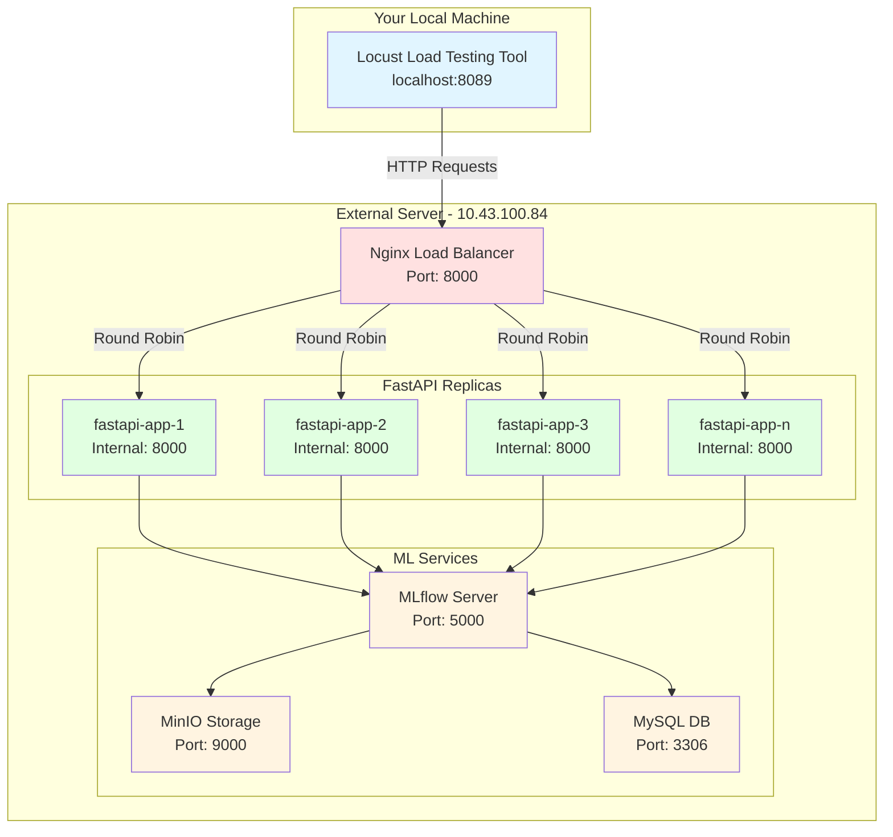
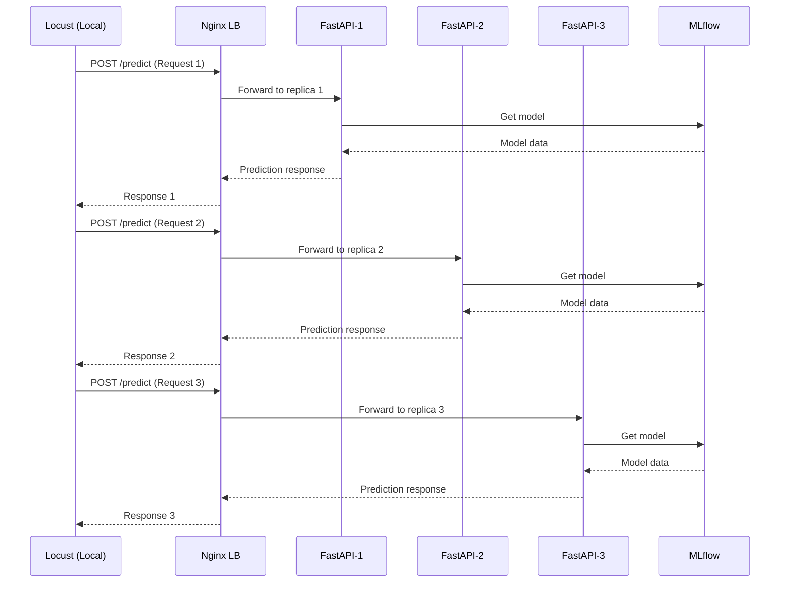

# Load Testing with Replicas - Deployment Guide

## Architecture Overview



## Request Flow



## Setup on External Server (10.43.100.84)

### Step 1: Start the API with Multiple Replicas

Navigate to the Taller_5 directory and start the services:

```bash
cd /path/to/Talleres/Taller_5

# Start all services with 3 FastAPI replicas
docker-compose -f docker-compose-api.yml up -d --scale fastapi-app=3

# Or start with a different number of replicas (e.g., 5 replicas)
docker-compose -f docker-compose-api.yml up -d --scale fastapi-app=5
```

### Step 2: Verify Services are Running

```bash
# Check all containers
docker-compose -f docker-compose-api.yml ps

# You should see:
# - mysql-mlflow-metadata
# - mlflow_server
# - minio_server
# - model_trainer (completed)
# - fastapi-app_1, fastapi-app_2, fastapi-app_3 (or more)
# - nginx_load_balancer

# Check Nginx logs
docker logs nginx_load_balancer

# Test the load balancer
curl http://localhost:8000/health
```

### Step 3: Verify Load Balancing

Test that Nginx is distributing requests across replicas:

```bash
# Make multiple requests and check which replica responds
for i in {1..10}; do
  curl http://localhost:8000/health
  echo ""
done
```

### Step 4: Check Firewall (Important!)

Ensure port 8000 is accessible from your local machine:

```bash
# Check if port 8000 is listening
sudo netstat -tlnp | grep :8000

# Or with ss
sudo ss -tlnp | grep :8000

# If using ufw firewall, allow port 8000
sudo ufw allow 8000/tcp
sudo ufw status
```

## Setup on Your Local Machine

### Step 1: Test Connection to External Server

```bash
# From your local machine, test connectivity
curl http://10.43.100.84:8000/health

# Expected response:
# {"status":"ok","model_loaded":true}
```

### Step 2: Run Load Testing

```bash
cd /path/to/Talleres/Taller_5

# Start Locust
docker-compose -f docker-compose-load-testing.yml up

# Access Locust UI at: http://localhost:8089
```

### Step 3: Configure Locust Test

1. Open browser: `http://localhost:8089`
2. The host is pre-configured to: `http://10.43.100.84:8000`
3. Set number of users and spawn rate
4. Start the test

## Scaling Commands

### Increase Replicas (While Running)

```bash
# Scale up to 5 replicas
docker-compose -f docker-compose-api.yml up -d --scale fastapi-app=5 --no-recreate

# Nginx will automatically detect new replicas via Docker DNS
```

### Decrease Replicas

```bash
# Scale down to 2 replicas
docker-compose -f docker-compose-api.yml up -d --scale fastapi-app=2 --no-recreate
```

### Stop Everything

```bash
# Stop all services
docker-compose -f docker-compose-api.yml down

# Stop and remove volumes (clean restart)
docker-compose -f docker-compose-api.yml down -v
```

## Monitoring

### Check Nginx Status

```bash
# View Nginx status (from external server)
curl http://localhost:8000/nginx_status

# View Nginx logs
docker logs -f nginx_load_balancer
```

### Check FastAPI Replica Logs

```bash
# View logs from all FastAPI replicas
docker-compose -f docker-compose-api.yml logs -f fastapi-app

# View logs from specific replica
docker logs <container_name>  # e.g., taller_5_fastapi-app_1
```

### Monitor Resource Usage

```bash
# Check CPU and memory usage per container
docker stats

# Filter for FastAPI containers only
docker stats $(docker ps --filter "name=fastapi-app" -q)
```

## Troubleshooting

### Issue: Can't connect from local machine

**Solution:**
1. Check firewall on external server: `sudo ufw status`
2. Verify port 8000 is exposed: `sudo netstat -tlnp | grep :8000`
3. Test from external server itself: `curl http://localhost:8000/health`
4. Check if Nginx is running: `docker ps | grep nginx`

### Issue: Nginx can't find FastAPI replicas

**Solution:**
1. Ensure all containers are on the same network: `docker network inspect taller_5_ml-services`
2. Check that FastAPI containers are healthy: `docker-compose -f docker-compose-api.yml ps`
3. Restart Nginx: `docker-compose -f docker-compose-api.yml restart nginx-lb`

### Issue: Port conflicts when scaling

**Solution:**
- Ensure no `container_name` is set for `fastapi-app` service
- Ensure `ports` is changed to `expose` for `fastapi-app` service
- Only Nginx should expose port 8000 externally

### Issue: Model not loading

**Solution:**
1. Check MLflow is healthy: `docker-compose -f docker-compose-api.yml ps mlflow`
2. Check model-trainer completed: `docker logs model_trainer`
3. Check FastAPI logs: `docker-compose -f docker-compose-api.yml logs fastapi-app`

## Performance Tips

### Optimal Replica Count

Consider your server resources:
- **4 CPU cores**: 2-3 replicas
- **8 CPU cores**: 4-6 replicas
- **16 CPU cores**: 8-12 replicas

Formula: `replicas = (CPU_cores - 2) * 1.5` (leaving 2 cores for other services)

### Resource Limits

Current per-replica limits in docker-compose-api.yml:
- CPU: 2.0 cores per replica
- Memory: 4GB per replica

Adjust based on your server capacity.

### Test Incrementally

1. Start with 2 replicas, run load test
2. Increase to 4 replicas, compare results
3. Continue scaling until performance plateaus
4. Find the optimal number for your hardware

## Quick Reference Commands

```bash
# On External Server (10.43.100.84)
cd /path/to/Talleres/Taller_5

# Start with 3 replicas
docker-compose -f docker-compose-api.yml up -d --scale fastapi-app=3

# Scale to 5 replicas
docker-compose -f docker-compose-api.yml up -d --scale fastapi-app=5 --no-recreate

# View status
docker-compose -f docker-compose-api.yml ps

# View logs
docker-compose -f docker-compose-api.yml logs -f

# Stop all
docker-compose -f docker-compose-api.yml down
```

```bash
# On Your Local Machine
cd /path/to/Talleres/Taller_5

# Test connection
curl http://10.43.100.84:8000/health

# Start load testing
docker-compose -f docker-compose-load-testing.yml up

# Access Locust: http://localhost:8089
```

## Expected Results

With proper scaling, you should see:
- **Linear throughput increase** up to CPU saturation
- **Lower latency** due to load distribution
- **Better fault tolerance** (if one replica fails, others continue)
- **Nginx distributing requests** evenly across replicas

Monitor `docker stats` to see resource usage across replicas during load testing.
