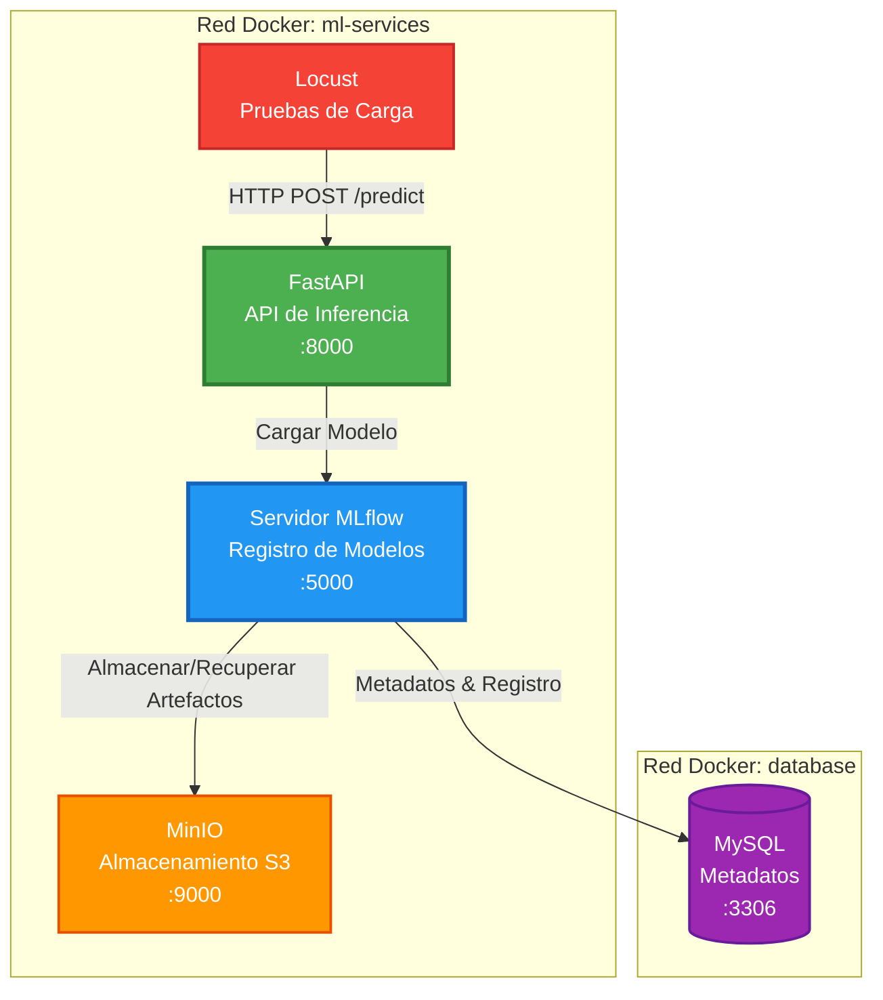

# Taller 5 - API de Inferencia de ML con Pruebas de Carga

Proyecto MLOps listo para producción que demuestra cómo desplegar una API de inferencia de *machine learning* usando FastAPI, MLflow para la gestión de modelos y Locust para las pruebas de carga. Este proyecto incluye servicios contenedorizados orquestados con Docker Compose.

## Tabla de Contenidos

- [Arquitectura](#arquitectura)
- [Prerrequisitos](#prerrequisitos)
- [Estructura del Proyecto](#estructura-del-proyecto)
- [Primeros Pasos](#primeros-pasos)
  - [Levantar la API de Inferencia](#levantar-la-api-de-inferencia)
  - [Ejecutar Pruebas de Carga](#ejecutar-pruebas-de-carga)
- [Despliegue en Docker Hub](#despliegue-en-docker-hub)
- [Endpoints de la API](#endpoints-de-la-api)
- [Pruebas de Carga](#pruebas-de-carga)
- [Contribuir](#contribuir)
- [Solución de Problemas](#solución-de-problemas)

---

## Arquitectura

La aplicación consta de múltiples microservicios que trabajan juntos en una infraestructura basada en Docker:



### Resumen de la Arquitectura

El sistema sigue una arquitectura de microservicios con separación clara de responsabilidades:

1. **Capa de Cliente** (Locust) → Simula tráfico de usuarios y envía solicitudes a la API.
2. **Capa de API** (FastAPI) → Maneja solicitudes de inferencia y carga modelos desde MLflow.
3. **Capa de Gestión de Modelos** (MLflow) → Administra modelos, experimentos y registro.
4. **Capa de Almacenamiento** (MinIO + MySQL) → Persiste artefactos y metadatos.

### Flujo de Datos

1. **Locust** envía solicitudes HTTP POST al endpoint `/predict`.
2. **API de Inferencia (FastAPI)** recibe las solicitudes y carga el modelo entrenado desde MLflow.
3. **Servidor MLflow** recupera artefactos del modelo desde MinIO y metadatos desde MySQL.
4. **MySQL** almacena datos de seguimiento de experimentos, información del registro de modelos y metadatos.
5. **MinIO** guarda artefactos del modelo, parámetros y métricas en un almacenamiento compatible con S3.

### Componentes

1. **API de Inferencia con FastAPI** ([inference_api/](inference_api/))
   - Sirve predicciones del modelo vía REST.
   - Carga modelos desde el Registro de Modelos de MLflow.
   - Construida con Python 3.11 y FastAPI.
   - Expone los endpoints `/predict` y `/health`.

2. **Servidor MLflow** ([mlflow/](mlflow/))
   - Gestiona el ciclo de vida de modelos de ML.
   - Almacena artefactos en MinIO.
   - Registra experimentos y versiones de modelos.
   - Provee capacidades de registro de modelos.

3. **MinIO**
   - Almacenamiento de objetos compatible con S3.
   - Guarda artefactos y modelos de MLflow.
   - Configurado con auto‑creación de *buckets*.

4. **MySQL**
   - Backend de metadatos para MLflow.
   - Almacena datos de seguimiento de experimentos.
   - Persiste información del registro de modelos.

5. **Locust** ([locust/](locust/))
   - *Framework* de pruebas de carga.
   - Simula usuarios concurrentes.
   - Ofrece una UI web para monitoreo.

---

## Prerrequisitos

Antes de empezar, asegúrate de tener instalado:

- **Docker** (versión 20.10 o superior)
- **Docker Compose** (versión 2.0 o superior)
- **Git** (para clonar y contribuir)

Para verificar la instalación:

```bash
docker --version
docker-compose --version
```

---

## Estructura del Proyecto

```
Taller_5/
├── README.md                          # Este archivo
├── Taller.md                          # Instrucciones del taller
├── docker-compose-api.yml             # *Stack* principal de la aplicación
├── docker-compose-load-testing.yml    # Configuración de pruebas de carga
│
├── inference_api/                     # Servicio de inferencia con FastAPI
│   ├── Dockerfile.inference
│   ├── Dockerfile.trainer
│   ├── requirements.txt
│   └── src/
│       ├── controller/
│       │   └── inference.py           # Endpoints de la API
│       └── service/
│           └── training_standalone.py # Lógica del servicio de ML
│
├── locust/                            # Scripts de pruebas de carga
│   ├── Dockerfile
│   ├── requirements.txt
│   └── main.py                        # Escenarios de Locust
│
└── mlflow/                            # Configuración de MLflow
    ├── Dockerfile
    └── requirements.txt
```

---

## Primeros Pasos

### Levantar la API de Inferencia

1. **Clonar el repositorio**

   ```bash
   git clone https://github.com/jcamilogomezc/MLOps-Grupo2.git
   cd MLOps-Grupo2/Talleres/Taller_5
   ```

2. **Iniciar los servicios**

   ```bash
   docker-compose -f docker-compose-api.yml up --build
   ```

   Este comando:
   - Construye la imagen de la API de inferencia con FastAPI.
   - Inicia la base de datos MySQL.
   - Inicia el almacenamiento de objetos MinIO.
   - Crea los *buckets* S3 requeridos.
   - Inicia el servidor de *tracking* MLflow.
   - Inicia la API de inferencia.

3. **Esperar a que los servicios estén saludables**

   Monitorea los *logs* hasta ver confirmaciones de *health checks*. Esto suele tardar entre 30 y 60 segundos.

4. **Acceder a los servicios**

   - **API de Inferencia**: http://localhost:8000
   - **Documentación de la API**: http://localhost:8000/docs
   - **UI de MLflow**: http://localhost:8005
   - **Consola de MinIO**: http://localhost:8009 (si está expuesta)

5. **Probar la API**

   ```bash
   # Health check
   curl http://localhost:8000/health

   # Realizar una predicción
   curl -X POST http://localhost:8000/predict      -H "Content-Type: application/json"      -d '{
       "feature1": 5.3,
       "feature2": 2.1,
       "feature3": 0.8
     }'
   ```

6. **Detener los servicios**

   ```bash
   docker-compose -f docker-compose-api.yml down
   ```

   Para remover también los volúmenes (se perderán los datos):

   ```bash
   docker-compose -f docker-compose-api.yml down -v
   ```

---

### Ejecutar Pruebas de Carga

1. **Asegúrate de que la API esté corriendo** (desde la sección anterior).

2. **Iniciar Locust**

   ```bash
   docker-compose -f docker-compose-load-testing.yml up --build
   ```

3. **Acceder a la UI de Locust**

   Abre tu navegador y ve a: http://localhost:8089

4. **Configurar y ejecutar pruebas**

   En la UI de Locust:
   - **Número de usuarios**: Empieza con 10, incrementa gradualmente hasta 10,000.
   - **Tasa de *spawn***: 500 usuarios por segundo (según requisitos del taller).
   - **Host**: Preconfigurado como http://10.43.100.84:8000 (VM PUJ)

5. **Monitorear resultados**

   Locust muestra métricas en tiempo real:
   - Solicitudes por segundo (RPS).
   - Tiempos de respuesta (mín., máx., promedio, percentiles).
   - Tasas de fallos.
   - Número de usuarios activos.

6. **Detener las pruebas de carga**

   ```bash
   docker-compose -f docker-compose-load-testing.yml down
   ```

---

## Despliegue en Docker Hub

### Construir y Publicar la Imagen de la API de Inferencia

1. **Construir la imagen de Docker**

   ```bash
   cd inference_api
   docker build -t your-dockerhub-username/inference-fast-api:v1.0 .
   ```

2. **Probar la imagen localmente**

   ```bash
   docker run -p 8000:8000      -e MLFLOW_TRACKING_URI=http://localhost:5001      your-dockerhub-username/inference-fast-api:v1.0
   ```

3. **Iniciar sesión en Docker Hub**

   ```bash
   docker login
   ```

   Ingresa tu usuario y contraseña de Docker Hub cuando se te solicite.

4. **Publicar la imagen**

   ```bash
   docker push your-dockerhub-username/inference-fast-api:v1.0
   ```

5. **Etiquetar versiones adicionales** (opcional)

   ```bash
   # Etiquetar como latest
   docker tag your-dockerhub-username/inference-fast-api:v1.0      your-dockerhub-username/inference-fast-api:latest

   docker push your-dockerhub-username/inference-fast-api:latest
   ```

6. **Actualizar docker-compose-api.yml**

   Reemplaza el nombre de la imagen en [docker-compose-api.yml:94](docker-compose-api.yml#L94):

   ```yaml
   fastapi-app:
     container_name: inference_api
     image: your-dockerhub-username/inference-fast-api:v1.0  # Actualiza esta línea
     # ... resto de la configuración
   ```

7. **Verificar el despliegue**

   Descargar y ejecutar desde Docker Hub:

   ```bash
   docker pull your-dockerhub-username/inference-fast-api:v1.0
   docker-compose -f docker-compose-api.yml up
   ```

### Despliegue Actual

La imagen actual se encuentra en: `jcamilogomezc/t5_inference_api:v2.0`

---

## Endpoints de la API

### *Health Check*

**Endpoint**: `GET /health`

**Descripción**: Verifica si la API está corriendo y saludable.

**Respuesta**:
```json
{
  "status": "ok"
}
```

**Ejemplo**:
```bash
curl http://localhost:8000/health
```

---

### Predicción

**Endpoint**: `POST /predict`

**Descripción**: Realiza predicciones usando el modelo entrenado.

**Cuerpo de la Solicitud**:
```json
{
  "feature1": 5.3,
  "feature2": 2.1,
  "feature3": 0.8
}
```

**Respuesta**:
```json
{
  "prediction": 123.456 # Puede variar
}
```

**Ejemplo**:
```bash
curl -X POST http://localhost:8000/predict   -H "Content-Type: application/json"   -d '{"feature1": 5.3, "feature2": 2.1, "feature3": 0.8}'
```

**Documentación Interactiva**:
- Swagger UI: http://localhost:8000/docs
- ReDoc: http://localhost:8000/redoc

---

## Pruebas de Carga

### Configuración de las Pruebas

La configuración de Locust en [locust/main.py](locust/main.py) define:

- **Tiempo de espera**: 1–2.5 segundos entre solicitudes por usuario.
- **Tarea**: petición POST al endpoint `/predict`.
- **Carga útil**: *payload* de ejemplo para la inferencia del modelo.

### Requisitos del Taller

Según [Taller.md](Taller.md), las metas son:

1. **Encontrar recursos mínimos** para soportar 10,000 usuarios concurrentes.
   - Agregar 500 usuarios de forma incremental.
   - Monitorear CPU, memoria y tiempos de respuesta.
   - Ajustar límites de recursos de los contenedores.

2. **Probar con réplicas**
   - Escalar horizontalmente la API de inferencia.
   - Comparar instancia única vs. múltiples instancias.
   - Documentar diferencias de rendimiento.

### Limitación de Recursos

Para limitar recursos de contenedores, modifica [docker-compose-api.yml](docker-compose-api.yml):

```yaml
fastapi-app:
  # ... configuración existente
  deploy:
    resources:
      limits:
        cpus: '0.5'      # Limitar a 0.5 núcleos
        memory: 512M     # Limitar a 512MB de RAM
      reservations:
        cpus: '0.25'
        memory: 256M
```

### Escalado por Réplicas

Para ejecutar múltiples instancias:

```yaml
fastapi-app:
  # ... configuración existente
  deploy:
    replicas: 3        # Ejecutar 3 instancias
    # ... límites de recursos
```

O usa el comando:

```bash
docker-compose -f docker-compose-api.yml up --scale fastapi-app=3
```

**Nota**: Elimina `container_name` cuando uses réplicas, ya que cada instancia necesita un nombre único.

---

## Contribuir

¡Se agradecen contribuciones para mejorar este proyecto! Por favor, sigue estas pautas:

### Cómo Contribuir

1. **Haz *fork* del repositorio**

   Haz clic en el botón "Fork" en la parte superior derecha de la página del repositorio en GitHub.

2. **Clona tu *fork***

   ```bash
   git clone https://github.com/jcamilogomezc/MLOps-Grupo2.git
   cd MLOps-Grupo2
   ```

3. **Crea una rama de *feature***

   ```bash
   git checkout -b feature/tu-nombre-de-feature
   ```

   Usa nombres descriptivos de rama:
   - `feature/add-new-endpoint`
   - `bugfix/fix-prediction-error`
   - `docs/update-readme`

4. **Realiza tus cambios**

   - Sigue las guías de estilo PEP 8 para Python.
   - Agrega comentarios para lógica compleja.
   - Actualiza documentación según sea necesario.
   - Prueba tus cambios localmente.

5. **Ejecuta pruebas**

   ```bash
   # Inicia los servicios
   docker-compose -f docker-compose-api.yml up --build

   # Prueba los endpoints
   curl http://localhost:8000/health
   curl -X POST http://localhost:8000/predict      -H "Content-Type: application/json"      -d '{"feature1": 1.0, "feature2": 2.0, "feature3": 3.0}'
   ```

6. **Haz *commit* de tus cambios**

   ```bash
   git add .
   git commit -m "feat: add descriptive commit message"
   ```

   Sigue [Conventional Commits](https://www.conventionalcommits.org/):
   - `feat:` - Nueva funcionalidad
   - `fix:` - Corrección de *bug*
   - `docs:` - Cambios en documentación
   - `refactor:` - Refactorización
   - `test:` - Agregar pruebas
   - `chore:` - Tareas de mantenimiento

7. ***Push* a tu *fork***

   ```bash
   git push origin feature/tu-nombre-de-feature
   ```

8. **Crea un *Pull Request***

   - Ve al repositorio original en GitHub.
   - Haz clic en "New Pull Request".
   - Selecciona tu *fork* y rama.
   - Completa la plantilla del PR con:
     - Descripción de cambios.
     - Números de issues relacionados.
     - Pruebas realizadas.
     - Capturas de pantalla (si aplica).

### Guías para Pull Requests

- **Título**: Claro y descriptivo.
- **Descripción**: Explica qué cambiaste y por qué.
- **Pruebas**: Describe cómo probaste tus cambios.
- **Documentación**: Actualiza README o docs según corresponda.
- **Calidad de Código**: Código limpio y bien comentado.
- **PRs pequeños**: Cambios enfocados y manejables.

### Estilo de Código

- **Python**: Sigue PEP 8.
- **Docstrings**: Estilo Google.
- **Type Hints**: Añádelos cuando aplique.
- **Comentarios**: Explica la lógica compleja.

### Reporte de Issues

Si encuentras un *bug* o tienes una sugerencia:

1. Verifica si el *issue* ya existe.
2. Crea uno nuevo con:
   - Título claro.
   - Descripción detallada.
   - Pasos para reproducir (para *bugs*).
   - Comportamiento esperado vs. actual.
   - Detalles de entorno (SO, versión de Docker, etc.).

### Preguntas o Ayuda

- Abre una Discusión en GitHub.
- Etiqueta *issues* con `question`.
- Contacta a los *maintainers*.

---

## Solución de Problemas

### Problemas Comunes

#### Los servicios no inician

**Problema**: Los contenedores fallan al iniciar o se caen inmediatamente.

**Soluciones**:
- Verifica que el *daemon* de Docker esté corriendo: `docker info`.
- Asegúrate de que los puertos no estén en uso: `lsof -i :8000`, `lsof -i :5001`.
- Revisa *logs* de Docker: `docker-compose -f docker-compose-api.yml logs`.
- Verifica que Docker tenga recursos suficientes (CPU, memoria, disco).

#### Puerto en uso

**Problema**: `Error: bind: address already in use`

**Soluciones**:
```bash
# Encontrar el proceso usando el puerto (ej., 8000)
lsof -i :8000

# Matar el proceso
kill -9 <PID>

# O cambiar el puerto en docker-compose-api.yml
ports:
  - "8001:8000"  # Usar 8001 en su lugar
```

#### *Health checks* fallando

**Problema**: Servicios marcados como *unhealthy*.

**Soluciones**:
- Espera un poco más (el arranque inicial tarda 30–60 s).
- Revisa logs del servicio: `docker logs mlflow_server`.
- Verifica dependencias: `docker-compose ps`.
- Revisa restricciones de recursos.

#### MLflow no puede conectarse a MySQL

**Problema**: `Can't connect to MySQL server`

**Soluciones**:
- Asegura que MySQL esté saludable: `docker-compose ps`.
- Revisa el *health check* en [docker-compose-api.yml:14-18](docker-compose-api.yml#L14-L18).
- Reinicia servicios: `docker-compose down && docker-compose up`.

#### Bucket de MinIO no creado

**Problema**: MLflow no puede almacenar artefactos.

**Soluciones**:
- Revisa logs del creador de *buckets*: `docker logs minio_bucket_creator`.
- Crear *bucket* manualmente:
  ```bash
  docker exec -it minio_server mc alias set myminio http://localhost:9000 admin supersecret
  docker exec -it minio_server mc mb myminio/mlflow-artifacts
  ```

#### Locust no conecta con la API

**Problema**: Locust no puede alcanzar la API de inferencia.

**Soluciones**:
- Verifica que la API esté arriba: `curl http://localhost:8000/health`.
- Revisa configuración de redes en los archivos de compose.
- Verifica la variable `LOCUST_HOST`.
- Revisa firewall/seguridad.

#### Errores por falta de memoria (OOM)

**Problema**: El contenedor se cae por OOM.

**Soluciones**:
- Incrementa el límite de memoria en Docker Desktop.
- Añade límites de recursos a los contenedores.
- Reduce el número de réplicas.
- Optimiza el tamaño del modelo.

#### No se puede hacer *push* a Docker Hub

**Problema**: Errores de autenticación o permisos.

**Soluciones**:
```bash
# Reautenticarse
docker logout
docker login

# Ver credenciales
docker info | grep Username

# Verifica que el repositorio exista en Docker Hub
# Créalo si es necesario en https://hub.docker.com
```

---

## Variables de Entorno

Variables clave usadas en [docker-compose-api.yml](docker-compose-api.yml):

### Configuración de MLflow
```bash
MLFLOW_TRACKING_URI=http://mlflow:5000
MLFLOW_S3_ENDPOINT_URL=http://minio:9000
MLFLOW_S3_IGNORE_TLS=true
MLFLOW_BUCKET_NAME=mlflow-artifacts
```

### Configuración de MinIO
```bash
MINIO_ROOT_USER=admin
MINIO_ROOT_PASSWORD=supersecret
```

### Configuración de MySQL
```bash
MYSQL_ROOT_PASSWORD=mlflow_root_pass
MYSQL_DATABASE=mlflow_metadata
MYSQL_USER=mlflow_meta
MYSQL_PASSWORD=mlflow_meta_pass
```

### Credenciales de AWS (compatibilidad S3 para MinIO)
```bash
AWS_ACCESS_KEY_ID=admin
AWS_SECRET_ACCESS_KEY=supersecret
```

---

## Recursos Adicionales

- **Documentación de FastAPI**: https://fastapi.tiangolo.com
- **Documentación de MLflow**: https://mlflow.org/docs/latest/index.html
- **Documentación de Locust**: https://docs.locust.io
- **Documentación de Docker Compose**: https://docs.docker.com/compose
- **Documentación de MinIO**: https://min.io/docs/minio/linux/index.html

---

## Licencia

Este proyecto hace parte del material del curso de MLOps. Consulta con los instructores del curso sobre uso y distribución.

---

## Autores

**MLOps - Grupo 2**

Para preguntas o soporte, por favor abre un *issue* en el repositorio de GitHub.