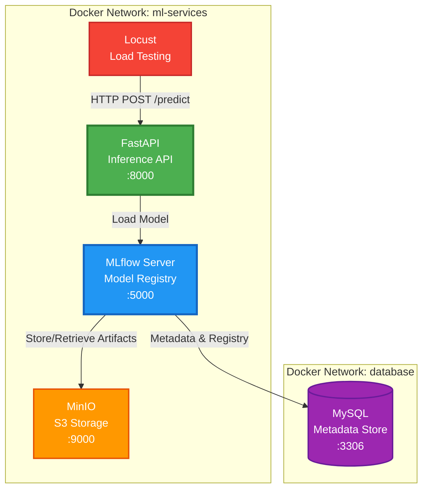

# Taller 5 - ML Inference API with Load Testing

A production-ready MLOps project that demonstrates how to deploy a machine learning inference API using FastAPI, MLflow for model management, and Locust for load testing. This project includes containerized services orchestrated with Docker Compose.

## Table of Contents

- [Architecture](#architecture)
- [Prerequisites](#prerequisites)
- [Project Structure](#project-structure)
- [Getting Started](#getting-started)
  - [Running the Inference API](#running-the-inference-api)
  - [Running Load Tests](#running-load-tests)
- [Docker Hub Deployment](#docker-hub-deployment)
- [API Endpoints](#api-endpoints)
- [Load Testing](#load-testing)
- [Contributing](#contributing)
- [Troubleshooting](#troubleshooting)

---

## Architecture

The application consists of multiple microservices working together in a Docker-based infrastructure:



### Architecture Overview

The system follows a microservices architecture with clear separation of concerns:

1. **Client Layer** (Locust) → Simulates user traffic and sends requests to API
2. **API Layer** (FastAPI) → Handles inference requests and loads models from MLflow
3. **Model Management Layer** (MLflow) → Manages ML models, experiments, and registry
4. **Storage Layer** (MinIO + MySQL) → Persists artifacts and metadata

### Data Flow

1. **Locust** sends HTTP POST requests to `/predict` endpoint
2. **FastAPI Inference API** receives requests and loads the trained model from MLflow
3. **MLflow Server** retrieves model artifacts from MinIO and metadata from MySQL
4. **MySQL** stores experiment tracking data, model registry information, and metadata
5. **MinIO** stores model artifacts, parameters, and metrics in S3-compatible storage

### Components

1. **FastAPI Inference API** ([inference_api/](inference_api/))
   - Serves ML model predictions via REST API
   - Loads models from MLflow Model Registry
   - Built with Python 3.11 and FastAPI
   - Exposes `/predict` and `/health` endpoints

2. **MLflow Server** ([mlflow/](mlflow/))
   - Manages ML model lifecycle
   - Stores model artifacts in MinIO
   - Tracks experiments and model versions
   - Provides model registry capabilities

3. **MinIO**
   - S3-compatible object storage
   - Stores MLflow artifacts and models
   - Configured with bucket auto-creation

4. **MySQL**
   - Metadata backend for MLflow
   - Stores experiment tracking data
   - Persists model registry information

5. **Locust** ([locust/](locust/))
   - Load testing framework
   - Simulates concurrent users
   - Provides web-based monitoring UI

---

## Prerequisites

Before starting, ensure you have the following installed:

- **Docker** (version 20.10 or higher)
- **Docker Compose** (version 2.0 or higher)
- **Git** (for cloning and contributing)

To verify your installation:

```bash
docker --version
docker-compose --version
```

---

## Project Structure

```
Taller_5/
├── README.md                          # This file
├── Taller.md                          # Workshop instructions
├── docker-compose-api.yml             # Main application stack
├── docker-compose-load-testing.yml    # Load testing configuration
│
├── inference_api/                     # FastAPI inference service
│   ├── Dockerfile.inference
│   ├── Dockerfile.trainer
│   ├── requirements.txt
│   └── src/
│       ├── controller/
│       │   └── inference.py           # API endpoints
│       └── service/
│           └── training_standalone.py # ML service logic
│
├── locust/                            # Load testing scripts
│   ├── Dockerfile
│   ├── requirements.txt
│   └── main.py                        # Locust test scenarios
│
└── mlflow/                            # MLflow configuration
    ├── Dockerfile
    └── requirements.txt
```

---

## Getting Started

### Running the Inference API

1. **Clone the repository**

   ```bash
   git clone https://github.com/jcamilogomezc/MLOps-Grupo2.git
   cd MLOps-Grupo2/Talleres/Taller_5
   ```

2. **Start the services**

   ```bash
   docker-compose -f docker-compose-api.yml up --build
   ```

   This command will:
   - Build the FastAPI inference API image
   - Start MySQL database
   - Start MinIO object storage
   - Create required S3 buckets
   - Start MLflow tracking server
   - Start the inference API

3. **Wait for services to be healthy**

   Monitor the logs until you see health check confirmations. This typically takes 30-60 seconds.

4. **Access the services**

   - **Inference API**: http://localhost:8000
   - **API Documentation**: http://localhost:8000/docs
   - **MLflow UI**: http://localhost:8005
   - **MinIO Console**: http://localhost:8009 (if exposed)

5. **Test the API**

   ```bash
   # Health check
   curl http://localhost:8000/health

   # Make a prediction
   curl -X POST http://localhost:8000/predict \
     -H "Content-Type: application/json" \
     -d '{
       "feature1": 5.3,
       "feature2": 2.1,
       "feature3": 0.8
     }'
   ```

6. **Stop the services**

   ```bash
   docker-compose -f docker-compose-api.yml down
   ```

   To also remove volumes (data will be lost):

   ```bash
   docker-compose -f docker-compose-api.yml down -v
   ```

---

### Running Load Tests

1. **Ensure the API is running** (from previous section)

2. **Start Locust**

   ```bash
   docker-compose -f docker-compose-load-testing.yml up --build
   ```

3. **Access Locust UI**

   Open your browser and navigate to: http://localhost:8089

4. **Configure and run tests**

   In the Locust UI:
   - **Number of users**: Start with 10, gradually increase to 10,000
   - **Spawn rate**: 500 users per second (as per workshop requirements)
   - **Host**: Pre-configured to http://api:8000

5. **Monitor results**

   Locust provides real-time metrics:
   - Requests per second (RPS)
   - Response times (min, max, average, percentiles)
   - Failure rates
   - Number of active users

6. **Stop load tests**

   ```bash
   docker-compose -f docker-compose-load-testing.yml down
   ```

---

## Docker Hub Deployment

### Building and Pushing the Inference API Image

1. **Build the Docker image**

   ```bash
   cd inference_api
   docker build -t your-dockerhub-username/inference-fast-api:v1.0 .
   ```

2. **Test the image locally**

   ```bash
   docker run -p 8000:8000 \
     -e MLFLOW_TRACKING_URI=http://localhost:5001 \
     your-dockerhub-username/inference-fast-api:v1.0
   ```

3. **Login to Docker Hub**

   ```bash
   docker login
   ```

   Enter your Docker Hub username and password when prompted.

4. **Push the image**

   ```bash
   docker push your-dockerhub-username/inference-fast-api:v1.0
   ```

5. **Tag additional versions** (optional)

   ```bash
   # Tag as latest
   docker tag your-dockerhub-username/inference-fast-api:v1.0 \
     your-dockerhub-username/inference-fast-api:latest

   docker push your-dockerhub-username/inference-fast-api:latest
   ```

6. **Update docker-compose-api.yml**

   Replace the image name in [docker-compose-api.yml:94](docker-compose-api.yml#L94):

   ```yaml
   fastapi-app:
     container_name: inference_api
     image: your-dockerhub-username/inference-fast-api:v1.0  # Update this line
     # ... rest of configuration
   ```

7. **Verify the deployment**

   Pull and run from Docker Hub:

   ```bash
   docker pull your-dockerhub-username/inference-fast-api:v1.0
   docker-compose -f docker-compose-api.yml up
   ```

### Current Deployment

The current image is hosted at: `germanaoq/inference-fast-api:v1.0`

---

## API Endpoints

### Health Check

**Endpoint**: `GET /health`

**Description**: Checks if the API is running and healthy

**Response**:
```json
{
  "status": "ok"
}
```

**Example**:
```bash
curl http://localhost:8000/health
```

---

### Prediction

**Endpoint**: `POST /predict`

**Description**: Makes predictions using the trained ML model

**Request Body**:
```json
{
  "feature1": 5.3,
  "feature2": 2.1,
  "feature3": 0.8
}
```

**Response**:
```json
{
  "prediction": 123.456 # May be different
}
```

**Example**:
```bash
curl -X POST http://localhost:8000/predict \
  -H "Content-Type: application/json" \
  -d '{"feature1": 5.3, "feature2": 2.1, "feature3": 0.8}'
```

**Interactive Documentation**:
- Swagger UI: http://localhost:8000/docs
- ReDoc: http://localhost:8000/redoc

---

## Load Testing

### Test Configuration

The Locust configuration in [locust/main.py](locust/main.py) defines:

- **Wait time**: 1-2.5 seconds between requests per user
- **Task**: POST request to `/predict` endpoint
- **Payload**: Sample features for model inference

### Workshop Requirements

As per [Taller.md](Taller.md), the goals are:

1. **Find minimum resources** to support 10,000 concurrent users
   - Add 500 users incrementally
   - Monitor CPU, memory, and response times
   - Adjust container resource limits

2. **Test with replicas**
   - Scale the inference API horizontally
   - Compare single vs. multiple instances
   - Document performance differences

### Resource Limiting

To limit container resources, modify [docker-compose-api.yml](docker-compose-api.yml):

```yaml
fastapi-app:
  # ... existing configuration
  deploy:
    resources:
      limits:
        cpus: '0.5'      # Limit to 0.5 CPU cores
        memory: 512M      # Limit to 512MB RAM
      reservations:
        cpus: '0.25'
        memory: 256M
```

### Scaling Replicas

To run multiple instances:

```yaml
fastapi-app:
  # ... existing configuration
  deploy:
    replicas: 3        # Run 3 instances
    # ... resource limits
```

Or use the command:

```bash
docker-compose -f docker-compose-api.yml up --scale fastapi-app=3
```

**Note**: Remove `container_name` when using replicas, as each instance needs a unique name.

---

## Contributing

We welcome contributions to improve this project! Please follow these guidelines:

### How to Contribute

1. **Fork the repository**

   Click the "Fork" button at the top right of the GitHub repository page.

2. **Clone your fork**

   ```bash
   git clone https://github.com/jcamilogomezc/MLOps-Grupo2.git
   cd MLOps-Grupo2
   ```

3. **Create a feature branch**

   ```bash
   git checkout -b feature/your-feature-name
   ```

   Use descriptive branch names:
   - `feature/add-new-endpoint`
   - `bugfix/fix-prediction-error`
   - `docs/update-readme`

4. **Make your changes**

   - Follow Python PEP 8 style guidelines
   - Add comments for complex logic
   - Update documentation as needed
   - Test your changes locally

5. **Run tests**

   ```bash
   # Start the services
   docker-compose -f docker-compose-api.yml up --build

   # Test the endpoints
   curl http://localhost:8000/health
   curl -X POST http://localhost:8000/predict \
     -H "Content-Type: application/json" \
     -d '{"feature1": 1.0, "feature2": 2.0, "feature3": 3.0}'
   ```

6. **Commit your changes**

   ```bash
   git add .
   git commit -m "feat: add descriptive commit message"
   ```

   Follow [Conventional Commits](https://www.conventionalcommits.org/):
   - `feat:` - New feature
   - `fix:` - Bug fix
   - `docs:` - Documentation changes
   - `refactor:` - Code refactoring
   - `test:` - Adding tests
   - `chore:` - Maintenance tasks

7. **Push to your fork**

   ```bash
   git push origin feature/your-feature-name
   ```

8. **Create a Pull Request**

   - Go to the original repository on GitHub
   - Click "New Pull Request"
   - Select your fork and branch
   - Fill in the PR template with:
     - Description of changes
     - Related issue numbers
     - Testing performed
     - Screenshots (if applicable)

### Pull Request Guidelines

- **Title**: Use clear, descriptive titles
- **Description**: Explain what changes you made and why
- **Testing**: Describe how you tested your changes
- **Documentation**: Update README or docs if needed
- **Code Quality**: Ensure code is clean and well-commented
- **Small PRs**: Keep changes focused and manageable

### Code Style

- **Python**: Follow PEP 8
- **Docstrings**: Use Google-style docstrings
- **Type Hints**: Add type hints where appropriate
- **Comments**: Explain complex logic

### Reporting Issues

If you find a bug or have a suggestion:

1. Check if the issue already exists
2. Create a new issue with:
   - Clear title
   - Detailed description
   - Steps to reproduce (for bugs)
   - Expected vs. actual behavior
   - Environment details (OS, Docker version, etc.)

### Questions or Help

- Open a GitHub Discussion
- Tag issues with `question` label
- Reach out to maintainers

---

## Troubleshooting

### Common Issues

#### Services won't start

**Problem**: Containers fail to start or crash immediately

**Solutions**:
- Check Docker daemon is running: `docker info`
- Ensure ports are not in use: `lsof -i :8000`, `lsof -i :5001`
- Check Docker logs: `docker-compose -f docker-compose-api.yml logs`
- Verify Docker has enough resources (CPU, memory, disk)

#### Port already in use

**Problem**: `Error: bind: address already in use`

**Solutions**:
```bash
# Find process using the port (e.g., 8000)
lsof -i :8000

# Kill the process
kill -9 <PID>

# Or change the port in docker-compose-api.yml
ports:
  - "8001:8000"  # Use 8001 instead
```

#### Health checks failing

**Problem**: Services marked as unhealthy

**Solutions**:
- Wait longer (initial startup takes 30-60 seconds)
- Check service logs: `docker logs mlflow_server`
- Verify dependencies are healthy: `docker-compose ps`
- Check resource constraints

#### MLflow can't connect to MySQL

**Problem**: `Can't connect to MySQL server`

**Solutions**:
- Ensure MySQL is healthy: `docker-compose ps`
- Check health check in [docker-compose-api.yml:14-18](docker-compose-api.yml#L14-L18)
- Restart services: `docker-compose down && docker-compose up`

#### MinIO bucket not created

**Problem**: MLflow can't store artifacts

**Solutions**:
- Check bucket creator logs: `docker logs minio_bucket_creator`
- Manually create bucket:
  ```bash
  docker exec -it minio_server mc alias set myminio http://localhost:9000 admin supersecret
  docker exec -it minio_server mc mb myminio/mlflow-artifacts
  ```

#### Load tests not connecting to API

**Problem**: Locust can't reach the inference API

**Solutions**:
- Ensure API is running: `curl http://localhost:8000/health`
- Check network configuration in docker-compose files
- Verify `LOCUST_HOST` environment variable
- Check firewall/security settings

#### Out of memory errors

**Problem**: Container crashes due to OOM

**Solutions**:
- Increase Docker memory limit (Docker Desktop settings)
- Add resource limits to containers
- Reduce number of replicas
- Optimize model size

#### Cannot push to Docker Hub

**Problem**: Authentication or permission errors

**Solutions**:
```bash
# Re-login
docker logout
docker login

# Check credentials
docker info | grep Username

# Verify repository exists on Docker Hub
# Create it if necessary at https://hub.docker.com
```

---

## Environment Variables

Key environment variables used in [docker-compose-api.yml](docker-compose-api.yml):

### MLflow Configuration
```bash
MLFLOW_TRACKING_URI=http://mlflow:5000
MLFLOW_S3_ENDPOINT_URL=http://minio:9000
MLFLOW_S3_IGNORE_TLS=true
MLFLOW_BUCKET_NAME=mlflow-artifacts
```

### MinIO Configuration
```bash
MINIO_ROOT_USER=admin
MINIO_ROOT_PASSWORD=supersecret
```

### MySQL Configuration
```bash
MYSQL_ROOT_PASSWORD=mlflow_root_pass
MYSQL_DATABASE=mlflow_metadata
MYSQL_USER=mlflow_meta
MYSQL_PASSWORD=mlflow_meta_pass
```

### AWS Credentials (for MinIO S3 compatibility)
```bash
AWS_ACCESS_KEY_ID=admin
AWS_SECRET_ACCESS_KEY=supersecret
```

---

## Additional Resources

- **FastAPI Documentation**: https://fastapi.tiangolo.com
- **MLflow Documentation**: https://mlflow.org/docs/latest/index.html
- **Locust Documentation**: https://docs.locust.io
- **Docker Compose Documentation**: https://docs.docker.com/compose
- **MinIO Documentation**: https://min.io/docs/minio/linux/index.html

---

## License

This project is part of the MLOps course materials. Please check with course instructors regarding usage and distribution.

---

## Authors

**MLOps - Grupo 2**

For questions or support, please open an issue in the GitHub repository.
